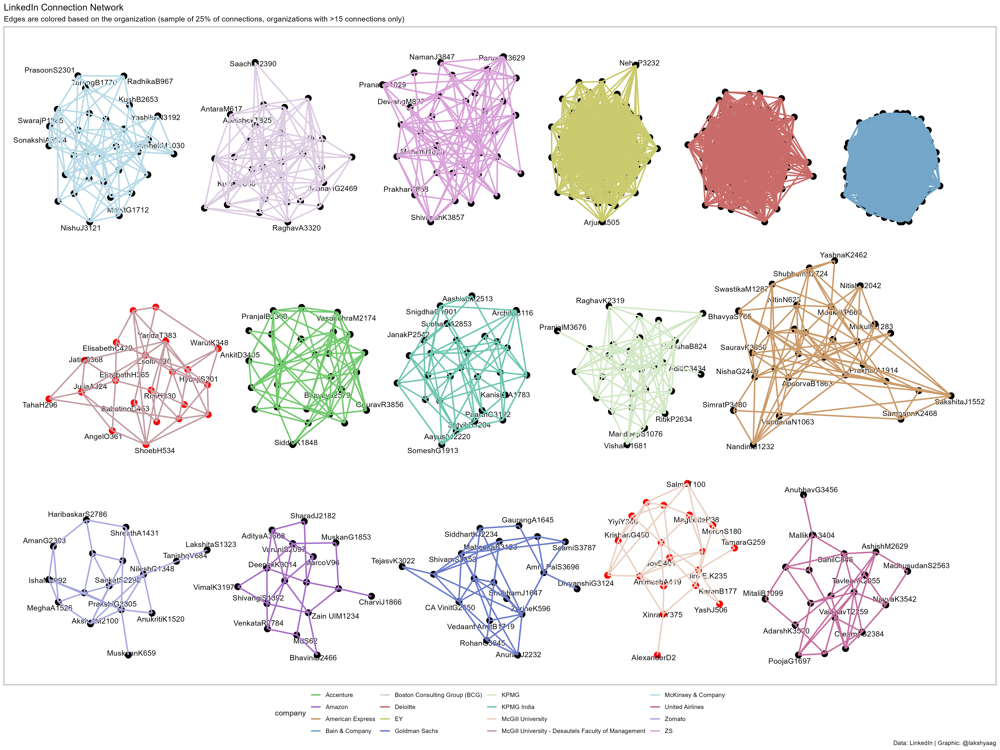

\newpage

# Setup

```{r setup, echo=T, results='hide'}
library(tidygraph)
library(tidyverse)
library(igraph)
library(ggplot2)
library(vroom)
library(scales)
library(ggraph)
library(ggtext)
library(ggrepel)
library(ggforce)
library(ggthemes)
library(patchwork)
library(qualpalr)

# setwd("./Exercise 1")
```

# Code

```{r}
data <- vroom("./Connections.csv", delim = ",", skip = 3)
```

## Data cleaning

```{r}
data <- data %>%
  mutate(label = str_c(
    `First Name`,
    str_sub(`Last Name`, 1, 1),
    row_number()
  )) %>%
  select(label, Company) %>%
  drop_na()

data
```

## Summary metrics

```{r}
data %>%
  count()
```

```{r}
data %>%
  group_by(Company) %>%
  count(sort = TRUE)
```

```{r}
companies_with_more_than_15 <- data %>%
  group_by(Company) %>%
  count(sort = TRUE) %>%
  filter(n > 15)

companies_with_more_than_15
```

## Creating a graph data structure

```{r}
connection_df <- data %>%
  filter(Company %in% companies_with_more_than_15$Company) %>%
  group_by(Company) %>%
  summarise(label_combinations = list(combn(label, 2, simplify = FALSE))) %>%
  unnest(label_combinations) %>%
  transmute(
    from = map_chr(label_combinations, 1),
    to = map_chr(label_combinations, 2),
    company = Company
  )

connection_df
```

### Taking a sample of the data

```{r}
set.seed(257)

graph_data <- connection_df %>%
  slice_sample(prop = 0.25) %>%
  as_tbl_graph(directed = FALSE)

graph_data
```

### Generating a color palette

```{r colors}
color_palette <- qualpal(
  (graph_data %>%
    activate("edges") %>%
    pull(company) %>%
    unique() %>%
    length()
  ),
  colorspace = "pretty"
)

show_col(color_palette$hex)
```

### Get a list of names in `McGill University + DFOM`

```{r}
mcgill_names <- (connection_df %>%
  filter(company %in% c(
    "McGill University",
    "McGill University - Desautels Faculty of Management"
  ))
) %>%
  select(from, to) %>%
  pivot_longer(cols = c(from, to)) %>%
  distinct() %>%
  pull(value)
```

## Creating the graph

```{r}
graph_layout <- create_layout(graph_data, layout = "backbone", keep = 0.7)

graph_vis <- ggraph(graph_layout) +
  geom_node_point(
    size = 4,
    color = ifelse(
      graph_data %>%
        activate("nodes") %>%
        pull(name) %in% mcgill_names,
      "red",
      "black"
    )
  ) +
  geom_node_text(aes(label = name),
    repel = TRUE,
    max.overlaps = 2, check_overlap = TRUE
  ) +
  geom_edge_link0(aes(color = company), show.legend = TRUE, width = 1) +
  scale_edge_color_manual(values = color_palette$hex) +
  theme_void() +
  theme(
    legend.position = "bottom",
    panel.border = element_rect(fill = NA)
  ) +
  plot_annotation(
    title = "LinkedIn Connection Network",
    subtitle = "Edges are colored based on the organization (sample of 25% of connections, organizations with >15 connections only)",
    caption = "Data: LinkedIn | Graphic: @lakshyaag"
  )

# Saving the graph
ggsave("linkedin_networks_graph.png",
  graph_vis,
  width = 20,
  height = 15,
  dpi = 300,
  device = "png"
)
```

# Result


