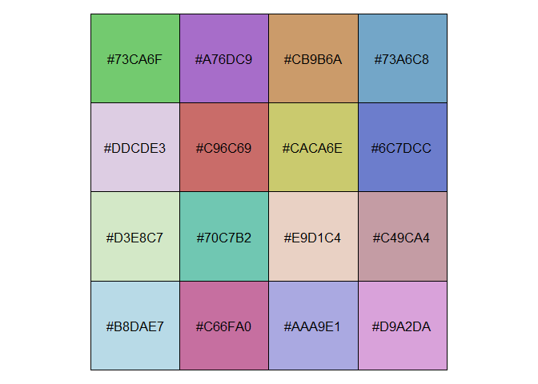
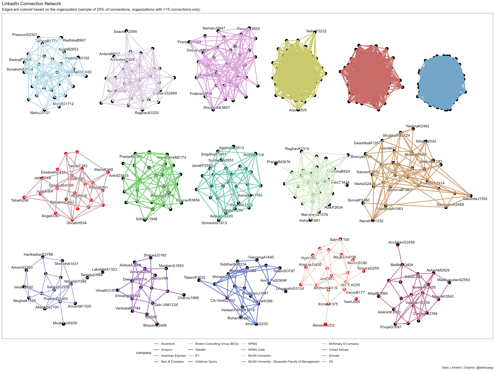

Exercise 1: ORGB 672
================
Lakshya Agarwal
2024-03-17

- [Setup](#setup)
- [Code](#code)
  - [Data cleaning](#data-cleaning)
  - [Summary metrics](#summary-metrics)
  - [Creating a graph data structure](#creating-a-graph-data-structure)
    - [Taking a sample of the data](#taking-a-sample-of-the-data)
    - [Generating a color palette](#generating-a-color-palette)
    - [Get a list of names in
      `McGill University + DFOM`](#get-a-list-of-names-in-mcgill-university--dfom)
  - [Creating the graph](#creating-the-graph)
- [Result](#result)

# Setup

``` r
library(tidygraph)
```

    ## Warning: package 'tidygraph' was built under R version 4.3.3

    ## 
    ## Attaching package: 'tidygraph'

    ## The following object is masked from 'package:stats':
    ## 
    ##     filter

``` r
library(tidyverse)
```

    ## ── Attaching core tidyverse packages ──────────────────────── tidyverse 2.0.0 ──
    ## ✔ dplyr     1.1.2     ✔ readr     2.1.4
    ## ✔ forcats   1.0.0     ✔ stringr   1.5.0
    ## ✔ ggplot2   3.4.3     ✔ tibble    3.2.1
    ## ✔ lubridate 1.9.2     ✔ tidyr     1.3.0
    ## ✔ purrr     1.0.2

    ## ── Conflicts ────────────────────────────────────────── tidyverse_conflicts() ──
    ## ✖ dplyr::filter() masks tidygraph::filter(), stats::filter()
    ## ✖ dplyr::lag()    masks stats::lag()
    ## ℹ Use the conflicted package (<http://conflicted.r-lib.org/>) to force all conflicts to become errors

``` r
library(igraph)
```

    ## Warning: package 'igraph' was built under R version 4.3.3

    ## 
    ## Attaching package: 'igraph'
    ## 
    ## The following objects are masked from 'package:lubridate':
    ## 
    ##     %--%, union
    ## 
    ## The following objects are masked from 'package:dplyr':
    ## 
    ##     as_data_frame, groups, union
    ## 
    ## The following objects are masked from 'package:purrr':
    ## 
    ##     compose, simplify
    ## 
    ## The following object is masked from 'package:tidyr':
    ## 
    ##     crossing
    ## 
    ## The following object is masked from 'package:tibble':
    ## 
    ##     as_data_frame
    ## 
    ## The following object is masked from 'package:tidygraph':
    ## 
    ##     groups
    ## 
    ## The following objects are masked from 'package:stats':
    ## 
    ##     decompose, spectrum
    ## 
    ## The following object is masked from 'package:base':
    ## 
    ##     union

``` r
library(ggplot2)
library(vroom)
```

    ## 
    ## Attaching package: 'vroom'
    ## 
    ## The following objects are masked from 'package:readr':
    ## 
    ##     as.col_spec, col_character, col_date, col_datetime, col_double,
    ##     col_factor, col_guess, col_integer, col_logical, col_number,
    ##     col_skip, col_time, cols, cols_condense, cols_only, date_names,
    ##     date_names_lang, date_names_langs, default_locale, fwf_cols,
    ##     fwf_empty, fwf_positions, fwf_widths, locale, output_column,
    ##     problems, spec

``` r
library(scales)
```

    ## 
    ## Attaching package: 'scales'
    ## 
    ## The following object is masked from 'package:vroom':
    ## 
    ##     col_factor
    ## 
    ## The following object is masked from 'package:purrr':
    ## 
    ##     discard
    ## 
    ## The following object is masked from 'package:readr':
    ## 
    ##     col_factor

``` r
library(ggraph)
library(ggtext)
library(ggrepel)
library(ggforce)
library(ggthemes)
library(patchwork)
library(qualpalr)
```

    ## Warning: package 'qualpalr' was built under R version 4.3.3

``` r
# setwd("./Exercise 1")
```

# Code

``` r
data <- vroom("./Connections.csv", delim = ",", skip = 3)
```

    ## Rows: 3871 Columns: 7
    ## ── Column specification ────────────────────────────────────────────────────────
    ## Delimiter: ","
    ## chr (7): First Name, Last Name, URL, Email Address, Company, Position, Conne...
    ## 
    ## ℹ Use `spec()` to retrieve the full column specification for this data.
    ## ℹ Specify the column types or set `show_col_types = FALSE` to quiet this message.

## Data cleaning

``` r
data <- data %>%
  mutate(label = str_c(
    `First Name`,
    str_sub(`Last Name`, 1, 1),
    row_number()
  )) %>%
  select(label, Company) %>%
  drop_na()

data
```

    ## # A tibble: 3,663 × 2
    ##    label        Company                                         
    ##    <chr>        <chr>                                           
    ##  1 ScottM1      Stadia Ventures                                 
    ##  2 AlexanderD2  McGill University                               
    ##  3 RyanR3       2U                                              
    ##  4 RushitS4     Wayfair                                         
    ##  5 JohnC5       Bain & Company                                  
    ##  6 AlessandroF6 ASP Alumni Association - Alta Scuola Politecnica
    ##  7 EricB7       GBK Collective                                  
    ##  8 JakeS8       Bain & Company                                  
    ##  9 AlissaM9     PSP Investments                                 
    ## 10 AlexandreP10 PSP Investments                                 
    ## # ℹ 3,653 more rows

## Summary metrics

``` r
data %>%
  count()
```

    ## # A tibble: 1 × 1
    ##       n
    ##   <int>
    ## 1  3663

``` r
data %>%
  group_by(Company) %>%
  count(sort = TRUE)
```

    ## # A tibble: 2,287 × 2
    ## # Groups:   Company [2,287]
    ##    Company                           n
    ##    <chr>                         <int>
    ##  1 Bain & Company                  155
    ##  2 Deloitte                         84
    ##  3 EY                               79
    ##  4 ZS                               34
    ##  5 Boston Consulting Group (BCG)    30
    ##  6 McKinsey & Company               30
    ##  7 American Express                 29
    ##  8 Accenture                        27
    ##  9 KPMG                             27
    ## 10 KPMG India                       27
    ## # ℹ 2,277 more rows

``` r
companies_with_more_than_15 <- data %>%
  group_by(Company) %>%
  count(sort = TRUE) %>%
  filter(n > 15)

companies_with_more_than_15
```

    ## # A tibble: 16 × 2
    ## # Groups:   Company [16]
    ##    Company                                                 n
    ##    <chr>                                               <int>
    ##  1 Bain & Company                                        155
    ##  2 Deloitte                                               84
    ##  3 EY                                                     79
    ##  4 ZS                                                     34
    ##  5 Boston Consulting Group (BCG)                          30
    ##  6 McKinsey & Company                                     30
    ##  7 American Express                                       29
    ##  8 Accenture                                              27
    ##  9 KPMG                                                   27
    ## 10 KPMG India                                             27
    ## 11 McGill University - Desautels Faculty of Management    21
    ## 12 Goldman Sachs                                          19
    ## 13 McGill University                                      19
    ## 14 United Airlines                                        19
    ## 15 Amazon                                                 16
    ## 16 Zomato                                                 16

## Creating a graph data structure

``` r
connection_df <- data %>%
  filter(Company %in% companies_with_more_than_15$Company) %>%
  group_by(Company) %>%
  summarise(label_combinations = list(combn(label, 2, simplify = FALSE))) %>%
  unnest(label_combinations) %>%
  transmute(
    from = map_chr(label_combinations, 1),
    to = map_chr(label_combinations, 2),
    company = Company
  )

connection_df
```

    ## # A tibble: 22,355 × 3
    ##    from        to            company  
    ##    <chr>       <chr>         <chr>    
    ##  1 KritikaS770 DhruvG1276    Accenture
    ##  2 KritikaS770 AkhilA1373    Accenture
    ##  3 KritikaS770 DeepakS1380   Accenture
    ##  4 KritikaS770 KeshavG1486   Accenture
    ##  5 KritikaS770 AfifB1625     Accenture
    ##  6 KritikaS770 KanikaC1823   Accenture
    ##  7 KritikaS770 SiddhiK1848   Accenture
    ##  8 KritikaS770 KritikaS1904  Accenture
    ##  9 KritikaS770 SakshiY1936   Accenture
    ## 10 KritikaS770 VanshitaG2000 Accenture
    ## # ℹ 22,345 more rows

### Taking a sample of the data

``` r
set.seed(257)

graph_data <- connection_df %>%
  slice_sample(prop = 0.25) %>%
  as_tbl_graph(directed = FALSE)

graph_data
```

    ## # A tbl_graph: 630 nodes and 5588 edges
    ## #
    ## # An undirected simple graph with 16 components
    ## #
    ## # Node Data: 630 × 1 (active)
    ##    name          
    ##    <chr>         
    ##  1 TanishqA2552  
    ##  2 AishveryaA1807
    ##  3 AnirudhV1164  
    ##  4 SarthakS2851  
    ##  5 AdityaM499    
    ##  6 VishudhV1277  
    ##  7 RivaG933      
    ##  8 AnushkaS1879  
    ##  9 SankalpN1297  
    ## 10 RoopakG895    
    ## # ℹ 620 more rows
    ## #
    ## # Edge Data: 5,588 × 3
    ##    from    to company       
    ##   <int> <int> <chr>         
    ## 1     1    62 Bain & Company
    ## 2     2   526 Zomato        
    ## 3     3   245 KPMG India    
    ## # ℹ 5,585 more rows

### Generating a color palette

``` r
color_palette <- qualpal(
  (graph_data %>%
    activate("edges") %>%
    pull(company) %>%
    unique() %>%
    length()
  ),
  colorspace = "pretty"
)

show_col(color_palette$hex)
```

<!-- -->

### Get a list of names in `McGill University + DFOM`

``` r
mcgill_names <- (connection_df %>%
  filter(company %in% c(
    "McGill University",
    "McGill University - Desautels Faculty of Management"
  ))
) %>%
  select(from, to) %>%
  pivot_longer(cols = c(from, to)) %>%
  distinct() %>%
  pull(value)
```

## Creating the graph

``` r
graph_layout <- create_layout(graph_data, layout = "backbone", keep = 0.7)
```

    ## Warning in layout_as_backbone(graph, keep = keep, backbone = TRUE): input graph
    ## is disconnected. The algorithm works best on connected graphs and may lead to
    ## misleading results for graphs with disconnected components. Run the algorithm
    ## on each component separately and delete isolated nodes to mitigate this issue.

``` r
graph_vis <- ggraph(graph_layout) +
  geom_node_point(
    size = 4,
    color = ifelse(
      graph_data %>%
        activate("nodes") %>%
        pull(name) %in% mcgill_names,
      "red",
      "black"
    )
  ) +
  geom_node_text(aes(label = name),
    repel = TRUE,
    max.overlaps = 2, check_overlap = TRUE
  ) +
  geom_edge_link0(aes(color = company), show.legend = TRUE, width = 1) +
  scale_edge_color_manual(values = color_palette$hex) +
  theme_void() +
  theme(
    legend.position = "bottom",
    panel.border = element_rect(fill = NA)
  ) +
  plot_annotation(
    title = "LinkedIn Connection Network",
    subtitle = "Edges are colored based on the organization (sample of 25% of connections, organizations with >15 connections only)",
    caption = "Data: LinkedIn | Graphic: @lakshyaag"
  )

# Saving the graph
ggsave("linkedin_networks_graph.png",
  graph_vis,
  width = 20,
  height = 15,
  dpi = 300,
  device = "png"
)
```

    ## Warning: Using the `size` aesthetic in this geom was deprecated in ggplot2 3.4.0.
    ## ℹ Please use `linewidth` in the `default_aes` field and elsewhere instead.
    ## This warning is displayed once every 8 hours.
    ## Call `lifecycle::last_lifecycle_warnings()` to see where this warning was
    ## generated.

    ## Warning: ggrepel: 487 unlabeled data points (too many overlaps). Consider
    ## increasing max.overlaps

# Result

<figure>

<figcaption aria-hidden="true">LinkedIn Connections</figcaption>
</figure>
