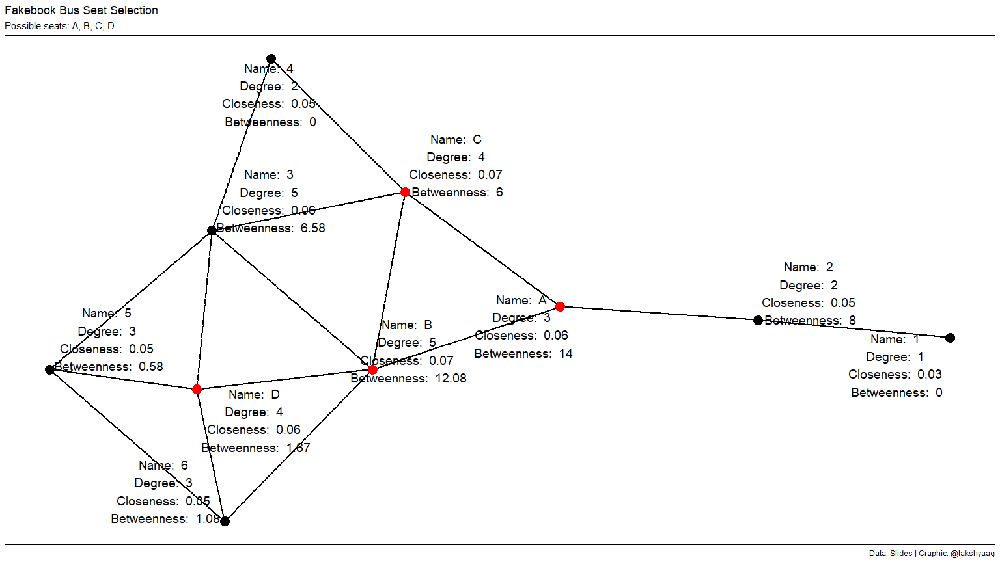

Exercise 2: ORGB 672
================
Lakshya Agarwal
2024-03-21

- [Setup](#setup)
- [Code](#code)
  - [Create a graph with the specified
    edges](#create-a-graph-with-the-specified-edges)
  - [Calculate centrality measures for {A, B, C,
    D}](#calculate-centrality-measures-for-a-b-c-d)
  - [Plot network with labels](#plot-network-with-labels)
- [Fakebook Bus Seat Selection
  Discussion](#fakebook-bus-seat-selection-discussion)
  - [Seat A](#seat-a)
    - [Benefits](#benefits)
    - [Drawbacks](#drawbacks)
  - [Seat B](#seat-b)
    - [Benefits](#benefits-1)
    - [Drawbacks](#drawbacks-1)
  - [Seat C](#seat-c)
    - [Benefits](#benefits-2)
    - [Drawbacks](#drawbacks-2)
  - [Seat D](#seat-d)
    - [Benefits](#benefits-3)
    - [Drawbacks](#drawbacks-3)
  - [Conclusion](#conclusion)

# Setup

``` r
library(tidygraph)
library(tidyverse)
library(igraph)
library(ggplot2)
library(vroom)
library(scales)
library(ggraph)
library(ggtext)
library(ggrepel)
library(ggforce)
library(ggthemes)
library(patchwork)
library(qualpalr)

# setwd("./Exercise 2")
```

# Code

## Create a graph with the specified edges

``` r
edges <- vroom("./edge_list.csv", delim = ",")
```

    ## Rows: 16 Columns: 2
    ## ── Column specification ────────────────────────────────────────────────────────
    ## Delimiter: ","
    ## chr (2): from, to
    ## 
    ## ℹ Use `spec()` to retrieve the full column specification for this data.
    ## ℹ Specify the column types or set `show_col_types = FALSE` to quiet this message.

``` r
graph <- as_tbl_graph(edges, directed = FALSE)

graph
```

    ## # A tbl_graph: 10 nodes and 16 edges
    ## #
    ## # An undirected simple graph with 1 component
    ## #
    ## # Node Data: 10 × 1 (active)
    ##    name 
    ##    <chr>
    ##  1 1    
    ##  2 2    
    ##  3 A    
    ##  4 B    
    ##  5 D    
    ##  6 5    
    ##  7 C    
    ##  8 3    
    ##  9 6    
    ## 10 4    
    ## #
    ## # Edge Data: 16 × 2
    ##    from    to
    ##   <int> <int>
    ## 1     1     2
    ## 2     2     3
    ## 3     3     7
    ## # ℹ 13 more rows

## Calculate centrality measures for {A, B, C, D}

``` r
centrality_measures <- graph %>%
  activate(nodes) %>%
  mutate(
    degree = centrality_degree(),
    closeness = centrality_closeness(),
    betweenness = centrality_betweenness(),
    label = paste(
      "Name: ", name,
      "\nDegree: ", round(degree, 2),
      "\nCloseness: ", round(closeness, 2),
      "\nBetweenness: ", round(betweenness, 2)
    ),
    color = case_when(
      name %in% c("A", "B", "C", "D") ~ "red",
      TRUE ~ "black"
    )
  )

centrality_measures
```

    ## # A tbl_graph: 10 nodes and 16 edges
    ## #
    ## # An undirected simple graph with 1 component
    ## #
    ## # Node Data: 10 × 6 (active)
    ##    name  degree closeness betweenness label                                color
    ##    <chr>  <dbl>     <dbl>       <dbl> <chr>                                <chr>
    ##  1 1          1    0.0333       0     "Name:  1 \nDegree:  1 \nCloseness:… black
    ##  2 2          2    0.0455       8     "Name:  2 \nDegree:  2 \nCloseness:… black
    ##  3 A          3    0.0625      14     "Name:  A \nDegree:  3 \nCloseness:… red  
    ##  4 B          5    0.0714      12.1   "Name:  B \nDegree:  5 \nCloseness:… red  
    ##  5 D          4    0.0588       1.67  "Name:  D \nDegree:  4 \nCloseness:… red  
    ##  6 5          3    0.0476       0.583 "Name:  5 \nDegree:  3 \nCloseness:… black
    ##  7 C          4    0.0667       6     "Name:  C \nDegree:  4 \nCloseness:… red  
    ##  8 3          5    0.0625       6.58  "Name:  3 \nDegree:  5 \nCloseness:… black
    ##  9 6          3    0.0526       1.08  "Name:  6 \nDegree:  3 \nCloseness:… black
    ## 10 4          2    0.05         0     "Name:  4 \nDegree:  2 \nCloseness:… black
    ## #
    ## # Edge Data: 16 × 2
    ##    from    to
    ##   <int> <int>
    ## 1     1     2
    ## 2     2     3
    ## 3     3     7
    ## # ℹ 13 more rows

## Plot network with labels

``` r
network_plot <- centrality_measures %>%
  ggraph(layout = "stress") +
  geom_edge_link(width = 1) +
  geom_node_point(
    size = 5,
    aes(color = color)
  ) +
  scale_color_manual(values = c("black", "red")) +
  geom_node_text(aes(label = label), size = 5, repel = TRUE) +
  theme_void() +
  theme(
    legend.position = "none",
    panel.border = element_rect(fill = NA)
  ) +
  plot_annotation(
    title = "Fakebook Bus Seat Selection",
    subtitle = "Possible seats: A, B, C, D",
    caption = "Data: Slides | Graphic: @lakshyaag"
  )

network_plot
```

<!-- -->

``` r
ggsave("fakebook_bus_network_plot.png", network_plot,
  width = 16, height = 9, dpi = 300
)
```

# Fakebook Bus Seat Selection Discussion

As a new intern at Fakebook, choosing where to sit on the company bus is
an important decision for fostering informal connections with coworkers.

## Seat A

- **Degree**: 3
- **Closeness**: 0.06
- **Betweenness**: 14

### Benefits

- **Central Role**: With the highest betweenness, consistently choosing
  Seat A will place the intern in a position where many paths pass
  through, making them a key connector in the network.
- **Influence**: The intern could potentially influence the flow of
  information and communication by taking a central seat.

### Drawbacks

- **Responsibility**: The central role might come with the pressure of
  being involved in many interactions.
- **Overload**: There’s a risk of becoming overwhelmed by the need to
  facilitate conversations.

## Seat B

- **Degree**: 5
- **Closeness**: 0.07
- **Betweenness**: 12.08

### Benefits

- **Social Hub**: Seat B has the highest degree, offering the
  opportunity to directly connect with more people.
- **Accessibility**: High closeness means that the intern is, on
  average, closer to everyone else, facilitating easier communication
  and relationship-building.

### Drawbacks

- **Less Privacy**: More connections might mean less personal space and
  more interruptions.
- **High Engagement**: The intern might be expected to engage with a
  larger number of people regularly due to high proximity.

## Seat C

- **Degree**: 4
- **Closeness**: 0.07
- **Betweenness**: 6

### Benefits

- **Balanced Interaction**: Seat C offers a good balance of direct
  connections and centrality without the intensity of Seat B.
- **Strategic Position**: Moderately high closeness and betweenness
  suggest a strategic position for networking without being overwhelmed.

### Drawbacks

- **Less Prominent**: Not as central as Seat A or as connected as Seat
  B, which might limit networking opportunities.

## Seat D

- **Degree**: 4
- **Closeness**: 0.06
- **Betweenness**: 1.67

### Benefits

- **Quiet Networking**: Seat D allows for networking opportunities with
  a reasonable number of direct connections and a lower profile in the
  network.
- **Less Pressure**: Lower betweenness means less responsibility in
  facilitating interactions.

### Drawbacks

- **Peripheral Role**: Less centrality might make it harder for the
  intern to establish themselves as a key player in the network.
- **Indirect Influence**: The intern may have less influence on the
  overall flow of communication due to a lower betweenness centrality.

## Conclusion

In conclusion, the intern’s choice should align with their networking
style and desired level of interaction. If the goal is to be a central
figure, Seat A or B might be the best choice. Seat C offers a balanced
approach, while Seat D is not recommended for the intern’s purposes.
