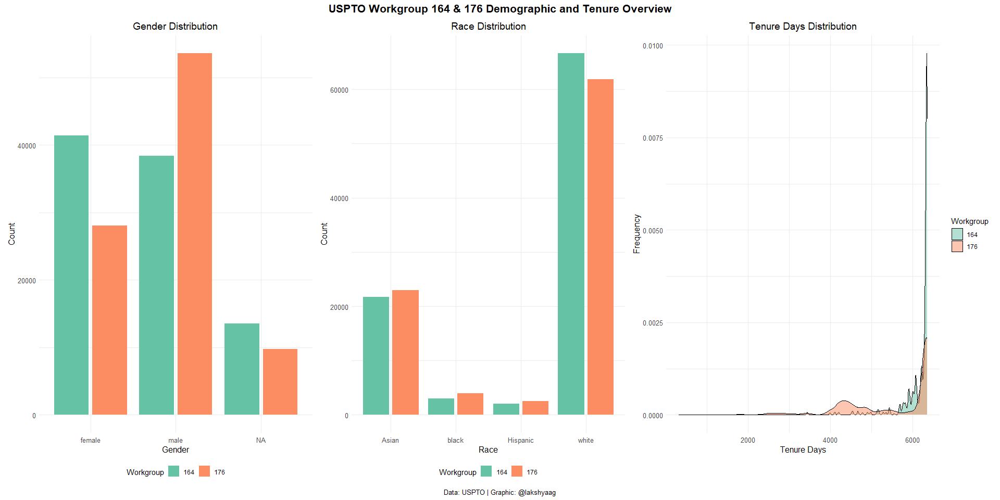
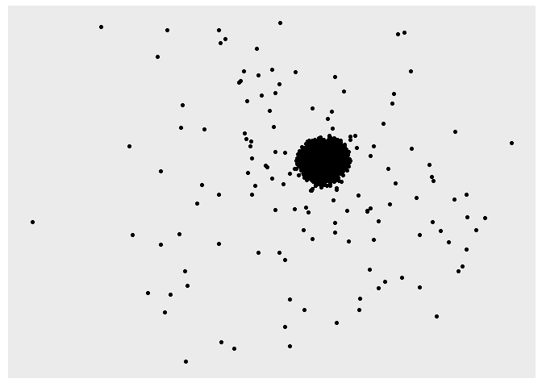
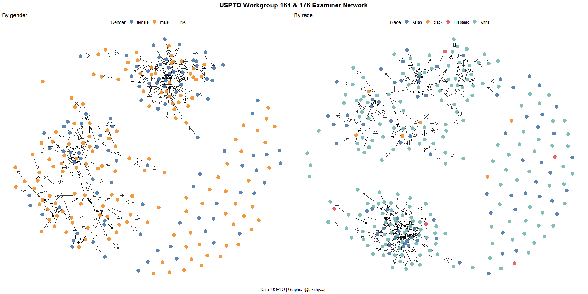

Exercise 3: ORGB 672
================
Lakshya Agarwal
2024-04-02

- [Setup](#setup)
- [Code](#code)
  - [Loading and viewing the data](#loading-and-viewing-the-data)
  - [Get gender for examiners](#get-gender-for-examiners)
  - [Guess race for examiners](#guess-race-for-examiners)
  - [Examiner’s tenure](#examiners-tenure)
  - [Viewing the cleaned dataset](#viewing-the-cleaned-dataset)
  - [Picking workgroup](#picking-workgroup)
  - [Demographic overview for workgroup 164 and
    176](#demographic-overview-for-workgroup-164-and-176)
  - [Creating a network](#creating-a-network)
- [Plotting the network, colored by
  gender](#plotting-the-network-colored-by-gender)

# Setup

``` r
library(tidygraph)
```

    ## Warning: package 'tidygraph' was built under R version 4.3.3

    ## 
    ## Attaching package: 'tidygraph'

    ## The following object is masked from 'package:stats':
    ## 
    ##     filter

``` r
library(tidyverse)
```

    ## ── Attaching core tidyverse packages ──────────────────────── tidyverse 2.0.0 ──
    ## ✔ dplyr     1.1.2     ✔ readr     2.1.4
    ## ✔ forcats   1.0.0     ✔ stringr   1.5.0
    ## ✔ ggplot2   3.4.3     ✔ tibble    3.2.1
    ## ✔ lubridate 1.9.2     ✔ tidyr     1.3.0
    ## ✔ purrr     1.0.2

    ## ── Conflicts ────────────────────────────────────────── tidyverse_conflicts() ──
    ## ✖ dplyr::filter() masks tidygraph::filter(), stats::filter()
    ## ✖ dplyr::lag()    masks stats::lag()
    ## ℹ Use the conflicted package (<http://conflicted.r-lib.org/>) to force all conflicts to become errors

``` r
library(igraph)
```

    ## Warning: package 'igraph' was built under R version 4.3.3

    ## 
    ## Attaching package: 'igraph'
    ## 
    ## The following objects are masked from 'package:lubridate':
    ## 
    ##     %--%, union
    ## 
    ## The following objects are masked from 'package:dplyr':
    ## 
    ##     as_data_frame, groups, union
    ## 
    ## The following objects are masked from 'package:purrr':
    ## 
    ##     compose, simplify
    ## 
    ## The following object is masked from 'package:tidyr':
    ## 
    ##     crossing
    ## 
    ## The following object is masked from 'package:tibble':
    ## 
    ##     as_data_frame
    ## 
    ## The following object is masked from 'package:tidygraph':
    ## 
    ##     groups
    ## 
    ## The following objects are masked from 'package:stats':
    ## 
    ##     decompose, spectrum
    ## 
    ## The following object is masked from 'package:base':
    ## 
    ##     union

``` r
library(ggplot2)
library(vroom)
```

    ## 
    ## Attaching package: 'vroom'
    ## 
    ## The following objects are masked from 'package:readr':
    ## 
    ##     as.col_spec, col_character, col_date, col_datetime, col_double,
    ##     col_factor, col_guess, col_integer, col_logical, col_number,
    ##     col_skip, col_time, cols, cols_condense, cols_only, date_names,
    ##     date_names_lang, date_names_langs, default_locale, fwf_cols,
    ##     fwf_empty, fwf_positions, fwf_widths, locale, output_column,
    ##     problems, spec

``` r
library(arrow)
```

    ## Warning: package 'arrow' was built under R version 4.3.3

    ## 
    ## Attaching package: 'arrow'
    ## 
    ## The following object is masked from 'package:lubridate':
    ## 
    ##     duration
    ## 
    ## The following object is masked from 'package:utils':
    ## 
    ##     timestamp

``` r
library(scales)
```

    ## 
    ## Attaching package: 'scales'
    ## 
    ## The following object is masked from 'package:vroom':
    ## 
    ##     col_factor
    ## 
    ## The following object is masked from 'package:purrr':
    ## 
    ##     discard
    ## 
    ## The following object is masked from 'package:readr':
    ## 
    ##     col_factor

``` r
library(ggraph)
library(ggtext)
library(ggrepel)
library(ggforce)
library(ggthemes)
library(patchwork)
library(qualpalr)
```

    ## Warning: package 'qualpalr' was built under R version 4.3.3

``` r
library(gender)
```

    ## Warning: package 'gender' was built under R version 4.3.3

``` r
library(wru)
```

    ## Warning: package 'wru' was built under R version 4.3.3

    ## 
    ## Please cite as:
    ## 
    ## Khanna K, Bertelsen B, Olivella S, Rosenman E, Rossell Hayes A, Imai K
    ## (2024). _wru: Who are You? Bayesian Prediction of Racial Category Using
    ## Surname, First Name, Middle Name, and Geolocation_. R package version
    ## 3.0.1, <https://CRAN.R-project.org/package=wru>.
    ## 
    ## Note that wru 2.0.0 uses 2020 census data by default.
    ## Use the argument `year = "2010"`, to replicate analyses produced with earlier package versions.

``` r
library(skimr)
```

    ## 
    ## Attaching package: 'skimr'
    ## 
    ## The following object is masked from 'package:tidygraph':
    ## 
    ##     focus

``` r
# setwd("./Exercise 3")
```

# Code

## Loading and viewing the data

``` r
patent_data <- read_parquet("app_data_sample.parquet")
edge_data <- vroom("edges_sample.csv", delim = ",")
```

    ## Rows: 32906 Columns: 4
    ## ── Column specification ────────────────────────────────────────────────────────
    ## Delimiter: ","
    ## chr  (1): application_number
    ## dbl  (2): ego_examiner_id, alter_examiner_id
    ## date (1): advice_date
    ## 
    ## ℹ Use `spec()` to retrieve the full column specification for this data.
    ## ℹ Specify the column types or set `show_col_types = FALSE` to quiet this message.

``` r
patent_data %>% head(10)
```

    ## # A tibble: 10 × 16
    ##    application_number filing_date examiner_name_last examiner_name_first
    ##    <chr>              <date>      <chr>              <chr>              
    ##  1 08284457           2000-01-26  HOWARD             JACQUELINE         
    ##  2 08413193           2000-10-11  YILDIRIM           BEKIR              
    ##  3 08531853           2000-05-17  HAMILTON           CYNTHIA            
    ##  4 08637752           2001-07-20  MOSHER             MARY               
    ##  5 08682726           2000-04-10  BARR               MICHAEL            
    ##  6 08687412           2000-04-28  GRAY               LINDA              
    ##  7 08716371           2004-01-26  MCMILLIAN          KARA               
    ##  8 08765941           2000-06-23  FORD               VANESSA            
    ##  9 08776818           2000-02-04  STRZELECKA         TERESA             
    ## 10 08809677           2002-02-20  KIM                SUN                
    ## # ℹ 12 more variables: examiner_name_middle <chr>, examiner_id <dbl>,
    ## #   examiner_art_unit <dbl>, uspc_class <chr>, uspc_subclass <chr>,
    ## #   patent_number <chr>, patent_issue_date <date>, abandon_date <date>,
    ## #   disposal_type <chr>, appl_status_code <dbl>, appl_status_date <chr>,
    ## #   tc <dbl>

## Get gender for examiners

Using the library `gender`, extract the gender from a list of distinct
`examiner_name_first` values. This will give us the gender of each first
name according to the library, which we can then join to our original
data

``` r
examiner_names <- patent_data %>%
  distinct(examiner_name_first)

examiner_names_gender <- examiner_names %>%
  do(results = gender(.$examiner_name_first, method = "ssa")) %>%
  unnest(cols = c(results), keep_empty = TRUE) %>%
  select(
    examiner_name_first = name,
    gender,
    proportion_female
  )

examiner_names_gender <- examiner_names_gender %>%
  select(examiner_name_first, gender)

patent_data <- patent_data %>%
  left_join(
    examiner_names_gender,
    by = "examiner_name_first"
  )

patent_data %>% head(10)
```

    ## # A tibble: 10 × 17
    ##    application_number filing_date examiner_name_last examiner_name_first
    ##    <chr>              <date>      <chr>              <chr>              
    ##  1 08284457           2000-01-26  HOWARD             JACQUELINE         
    ##  2 08413193           2000-10-11  YILDIRIM           BEKIR              
    ##  3 08531853           2000-05-17  HAMILTON           CYNTHIA            
    ##  4 08637752           2001-07-20  MOSHER             MARY               
    ##  5 08682726           2000-04-10  BARR               MICHAEL            
    ##  6 08687412           2000-04-28  GRAY               LINDA              
    ##  7 08716371           2004-01-26  MCMILLIAN          KARA               
    ##  8 08765941           2000-06-23  FORD               VANESSA            
    ##  9 08776818           2000-02-04  STRZELECKA         TERESA             
    ## 10 08809677           2002-02-20  KIM                SUN                
    ## # ℹ 13 more variables: examiner_name_middle <chr>, examiner_id <dbl>,
    ## #   examiner_art_unit <dbl>, uspc_class <chr>, uspc_subclass <chr>,
    ## #   patent_number <chr>, patent_issue_date <date>, abandon_date <date>,
    ## #   disposal_type <chr>, appl_status_code <dbl>, appl_status_date <chr>,
    ## #   tc <dbl>, gender <chr>

## Guess race for examiners

Using the library `wru`, extract race from a list of distinct
`examiner_name_first` values. This will give us the race probabilities
of each last name according to the library, which we can then take a
maximum on and join the results to our original data.

This process involves using the `predict_race` function from the `wru`
package, which estimates the race/ethnicity of a name based on U.S.
Census data. It’s important to note that this method provides an
estimate based on statistical models and should be used with an
understanding of its limitations and potential biases.

``` r
examiner_surnames <- patent_data %>%
  select(surname = examiner_name_last) %>%
  distinct()

examiner_race <- predict_race(voter.file = examiner_surnames, surname.only = TRUE) %>% as_tibble()
```

    ## Predicting race for 2020

    ## Warning: Unknown or uninitialised column: `state`.

    ## Proceeding with last name predictions...

    ## ℹ All local files already up-to-date!

    ## 701 (18.4%) individuals' last names were not matched.

``` r
examiner_race <- examiner_race %>%
  mutate(max_race_p = pmax(pred.asi, pred.bla, pred.his, pred.oth, pred.whi)) %>%
  mutate(race = case_when(
    max_race_p == pred.asi ~ "Asian",
    max_race_p == pred.bla ~ "black",
    max_race_p == pred.his ~ "Hispanic",
    max_race_p == pred.oth ~ "other",
    max_race_p == pred.whi ~ "white",
    TRUE ~ NA_character_
  )) %>%
  select(surname, race)

patent_data <- patent_data %>%
  left_join(examiner_race, by = c("examiner_name_last" = "surname"))

patent_data %>% head(10)
```

    ## # A tibble: 10 × 18
    ##    application_number filing_date examiner_name_last examiner_name_first
    ##    <chr>              <date>      <chr>              <chr>              
    ##  1 08284457           2000-01-26  HOWARD             JACQUELINE         
    ##  2 08413193           2000-10-11  YILDIRIM           BEKIR              
    ##  3 08531853           2000-05-17  HAMILTON           CYNTHIA            
    ##  4 08637752           2001-07-20  MOSHER             MARY               
    ##  5 08682726           2000-04-10  BARR               MICHAEL            
    ##  6 08687412           2000-04-28  GRAY               LINDA              
    ##  7 08716371           2004-01-26  MCMILLIAN          KARA               
    ##  8 08765941           2000-06-23  FORD               VANESSA            
    ##  9 08776818           2000-02-04  STRZELECKA         TERESA             
    ## 10 08809677           2002-02-20  KIM                SUN                
    ## # ℹ 14 more variables: examiner_name_middle <chr>, examiner_id <dbl>,
    ## #   examiner_art_unit <dbl>, uspc_class <chr>, uspc_subclass <chr>,
    ## #   patent_number <chr>, patent_issue_date <date>, abandon_date <date>,
    ## #   disposal_type <chr>, appl_status_code <dbl>, appl_status_date <chr>,
    ## #   tc <dbl>, gender <chr>, race <chr>

## Examiner’s tenure

To estimate the time spent by each examiner, we compare the earliest and
latest dates for each application. We then calculate the difference
between these two dates to get the tenure of each examiner and only keep
those who finished their tenure before 2018.

``` r
examiner_dates <- patent_data %>%
  select(examiner_id, filing_date, appl_status_date) %>%
  mutate(
    start_date = ymd(filing_date),
    end_date = as_date(dmy_hms(appl_status_date))
  )

examiner_dates <- examiner_dates %>%
  group_by(examiner_id) %>%
  summarise(
    earliest_date = min(start_date, na.rm = TRUE),
    latest_date = max(end_date, na.rm = TRUE),
    tenure_days = interval(earliest_date, latest_date) %/% days(1)
  ) %>%
  filter(year(latest_date) < 2018)

patent_data <- patent_data %>%
  left_join(examiner_dates, by = "examiner_id")

patent_data %>% head(10)
```

    ## # A tibble: 10 × 21
    ##    application_number filing_date examiner_name_last examiner_name_first
    ##    <chr>              <date>      <chr>              <chr>              
    ##  1 08284457           2000-01-26  HOWARD             JACQUELINE         
    ##  2 08413193           2000-10-11  YILDIRIM           BEKIR              
    ##  3 08531853           2000-05-17  HAMILTON           CYNTHIA            
    ##  4 08637752           2001-07-20  MOSHER             MARY               
    ##  5 08682726           2000-04-10  BARR               MICHAEL            
    ##  6 08687412           2000-04-28  GRAY               LINDA              
    ##  7 08716371           2004-01-26  MCMILLIAN          KARA               
    ##  8 08765941           2000-06-23  FORD               VANESSA            
    ##  9 08776818           2000-02-04  STRZELECKA         TERESA             
    ## 10 08809677           2002-02-20  KIM                SUN                
    ## # ℹ 17 more variables: examiner_name_middle <chr>, examiner_id <dbl>,
    ## #   examiner_art_unit <dbl>, uspc_class <chr>, uspc_subclass <chr>,
    ## #   patent_number <chr>, patent_issue_date <date>, abandon_date <date>,
    ## #   disposal_type <chr>, appl_status_code <dbl>, appl_status_date <chr>,
    ## #   tc <dbl>, gender <chr>, race <chr>, earliest_date <date>,
    ## #   latest_date <date>, tenure_days <dbl>

``` r
rm(examiner_dates)
rm(examiner_race)
rm(examiner_surnames)
rm(examiner_names)
gc()
```

    ##            used  (Mb) gc trigger   (Mb)  max used  (Mb)
    ## Ncells  4833852 258.2    8179000  436.9   8179000 436.9
    ## Vcells 58120393 443.5  138229730 1054.7 114539890 873.9

## Viewing the cleaned dataset

``` r
patent_data
```

    ## # A tibble: 2,018,477 × 21
    ##    application_number filing_date examiner_name_last examiner_name_first
    ##    <chr>              <date>      <chr>              <chr>              
    ##  1 08284457           2000-01-26  HOWARD             JACQUELINE         
    ##  2 08413193           2000-10-11  YILDIRIM           BEKIR              
    ##  3 08531853           2000-05-17  HAMILTON           CYNTHIA            
    ##  4 08637752           2001-07-20  MOSHER             MARY               
    ##  5 08682726           2000-04-10  BARR               MICHAEL            
    ##  6 08687412           2000-04-28  GRAY               LINDA              
    ##  7 08716371           2004-01-26  MCMILLIAN          KARA               
    ##  8 08765941           2000-06-23  FORD               VANESSA            
    ##  9 08776818           2000-02-04  STRZELECKA         TERESA             
    ## 10 08809677           2002-02-20  KIM                SUN                
    ## # ℹ 2,018,467 more rows
    ## # ℹ 17 more variables: examiner_name_middle <chr>, examiner_id <dbl>,
    ## #   examiner_art_unit <dbl>, uspc_class <chr>, uspc_subclass <chr>,
    ## #   patent_number <chr>, patent_issue_date <date>, abandon_date <date>,
    ## #   disposal_type <chr>, appl_status_code <dbl>, appl_status_date <chr>,
    ## #   tc <dbl>, gender <chr>, race <chr>, earliest_date <date>,
    ## #   latest_date <date>, tenure_days <dbl>

## Picking workgroup

To select the workgroups of interest, we first create a new column
`workgroup` to store the first 3 digits of the `examiner_art_unit`
column. We then count the number of applications in each workgroup and
sort them in descending order to see which workgroups to choose.

``` r
patent_data <- patent_data %>%
  mutate(workgroup = examiner_art_unit %/% 10)

patent_data %>%
  count(workgroup, sort = TRUE)
```

    ## # A tibble: 38 × 2
    ##    workgroup      n
    ##        <dbl>  <int>
    ##  1       162 141390
    ##  2       179 133424
    ##  3       164  93342
    ##  4       176  91376
    ##  5       163  90860
    ##  6       161  89795
    ##  7       177  83266
    ##  8       172  79195
    ##  9       171  76544
    ## 10       174  75598
    ## # ℹ 28 more rows

## Demographic overview for workgroup 164 and 176

With the workgroups chosen, we filter the data to only include
applications from these workgroups. We then create some summary plots to
compare the two.

``` r
workgroups_chosen <- c(164, 176)

workgroup_patent_data <- patent_data %>%
  filter(workgroup %in% workgroups_chosen)

workgroup_patent_data
```

    ## # A tibble: 184,718 × 22
    ##    application_number filing_date examiner_name_last examiner_name_first
    ##    <chr>              <date>      <chr>              <chr>              
    ##  1 08284457           2000-01-26  HOWARD             JACQUELINE         
    ##  2 08413193           2000-10-11  YILDIRIM           BEKIR              
    ##  3 08637752           2001-07-20  MOSHER             MARY               
    ##  4 08682726           2000-04-10  BARR               MICHAEL            
    ##  5 08765941           2000-06-23  FORD               VANESSA            
    ##  6 08901519           2000-09-26  DENT               ALANA              
    ##  7 09000004           2001-05-02  SAUNDERS           DAVID              
    ##  8 09011027           2000-05-01  LANDSMAN           ROBERT             
    ##  9 09077252           2000-05-20  PADMANABHAN        KARTIC             
    ## 10 09077740           2000-01-12  NOLAN              PATRICK            
    ## # ℹ 184,708 more rows
    ## # ℹ 18 more variables: examiner_name_middle <chr>, examiner_id <dbl>,
    ## #   examiner_art_unit <dbl>, uspc_class <chr>, uspc_subclass <chr>,
    ## #   patent_number <chr>, patent_issue_date <date>, abandon_date <date>,
    ## #   disposal_type <chr>, appl_status_code <dbl>, appl_status_date <chr>,
    ## #   tc <dbl>, gender <chr>, race <chr>, earliest_date <date>,
    ## #   latest_date <date>, tenure_days <dbl>, workgroup <dbl>

For demographic overview, we aim to visualize the distribution of gender
and race within the selected workgroups, as well as examining the tenure
days of examiners. These visualizations will help in understanding the
diversity and experience within these groups. To achieve this, we will
create summary plots for gender, race, and tenure days for workgroups
164 and 176.

``` r
# Define a consistent color palette
color_palette <- scale_fill_brewer(palette = "Set2")

# Gender distribution plot
p1 <- workgroup_patent_data %>%
  ggplot(aes(x = gender, fill = as.factor(workgroup))) +
  geom_bar(position = position_dodge2(width = 0.7)) +
  labs(title = "Gender Distribution", x = "Gender", y = "Count", fill = "Workgroup") +
  theme_minimal() +
  color_palette +
  theme(
    plot.title = element_text(hjust = 0.5, size = 14),
    axis.text = element_text(size = 10),
    axis.title = element_text(size = 12),
    legend.position = "bottom"
  )


# Race distribution plot
p2 <- workgroup_patent_data %>%
  ggplot(aes(x = race, fill = as.factor(workgroup))) +
  geom_bar(position = position_dodge2(width = 0.7)) +
  labs(title = "Race Distribution", x = "Race", y = "Count", fill = "Workgroup") +
  theme_minimal() +
  color_palette +
  theme(
    plot.title = element_text(hjust = 0.5, size = 14),
    axis.text = element_text(size = 10),
    axis.title = element_text(size = 12),
    legend.position = "bottom"
  )

# Tenure days histogram
p3 <- workgroup_patent_data %>%
  ggplot(aes(x = tenure_days, fill = as.factor(workgroup))) +
  geom_density(alpha = 0.5) +
  labs(title = "Tenure Days Distribution", x = "Tenure Days", y = "Frequency", fill = "Workgroup") +
  theme_minimal() +
  color_palette +
  theme(
    plot.title = element_text(hjust = 0.5, size = 14),
    axis.text = element_text(size = 10),
    axis.title = element_text(size = 12)
  )


# Combine plots
combined_plot <- p1 + p2 + p3 +
  plot_annotation(
    title = "USPTO Workgroup 164 & 176 Demographic and Tenure Overview",
    caption = "Data: USPTO | Graphic: @lakshyaag",
    theme = theme(
      plot.title = element_text(size = 16, hjust = 0.5, face = "bold"),
      plot.caption = element_text(size = 10, hjust = 0.5)
    )
  )

# Display the combined plot
combined_plot
```

    ## Warning: Removed 2901 rows containing non-finite values (`stat_density()`).

<!-- -->

``` r
ggsave("demographic_overview.png", device = "png", dpi = 300, width = 16, height = 9)
```

    ## Warning: Removed 2901 rows containing non-finite values (`stat_density()`).

- There is a notable difference in gender representation, with males
  being more prevalent than females in both workgroups.
- The ‘white’ category has the highest count in both workgroups,
  indicating that white individuals are the most represented race. The
  ‘Asian’ category is the second most represented, followed by ‘black’
  and ‘Hispanic’ categories, which have considerably lower counts. This
  suggests that there is less racial diversity within these workgroups,
  with a clear majority of white individuals.

Now we look at the mean tenure days and mean number of applications for
each workgroup to understand the experience and workload of examiners in
these groups.

``` r
workgroup_patent_data %>%
  group_by(workgroup) %>%
  summarise(
    mean_tenure = mean(tenure_days, na.rm = TRUE),
    num_applications = n()
  )
```

    ## # A tibble: 2 × 3
    ##   workgroup mean_tenure num_applications
    ##       <dbl>       <dbl>            <int>
    ## 1       164       6128.            93342
    ## 2       176       5501.            91376

Workgroup 164 has a higher mean tenure of ~6100 days, as compared to
~5500 days in Workgroup 176.

## Creating a network

To create a network of examiners, we first need to alter the edge and
node datasets to match the format expected by the `tidygraph` package.
We then create a graph object using the `tbl_graph` function and add
node data to it. We then calculate the degree, betweenness, and
closeness centrality measures for each node and visualize the network
using `ggraph`.

``` r
edge_data <- edge_data %>%
  mutate(
    from = as.character(ego_examiner_id),
    to = as.character(alter_examiner_id)
  ) %>%
  drop_na()
```

``` r
patent_data <- patent_data %>%
  relocate(examiner_id, .before = application_number) %>%
  mutate(examiner_id = as.character(examiner_id)) %>%
  drop_na(examiner_id) %>%
  rename(name = examiner_id)

patent_data
```

    ## # A tibble: 2,009,248 × 22
    ##    name  application_number filing_date examiner_name_last examiner_name_first
    ##    <chr> <chr>              <date>      <chr>              <chr>              
    ##  1 96082 08284457           2000-01-26  HOWARD             JACQUELINE         
    ##  2 87678 08413193           2000-10-11  YILDIRIM           BEKIR              
    ##  3 63213 08531853           2000-05-17  HAMILTON           CYNTHIA            
    ##  4 73788 08637752           2001-07-20  MOSHER             MARY               
    ##  5 77294 08682726           2000-04-10  BARR               MICHAEL            
    ##  6 68606 08687412           2000-04-28  GRAY               LINDA              
    ##  7 89557 08716371           2004-01-26  MCMILLIAN          KARA               
    ##  8 97543 08765941           2000-06-23  FORD               VANESSA            
    ##  9 98714 08776818           2000-02-04  STRZELECKA         TERESA             
    ## 10 65530 08809677           2002-02-20  KIM                SUN                
    ## # ℹ 2,009,238 more rows
    ## # ℹ 17 more variables: examiner_name_middle <chr>, examiner_art_unit <dbl>,
    ## #   uspc_class <chr>, uspc_subclass <chr>, patent_number <chr>,
    ## #   patent_issue_date <date>, abandon_date <date>, disposal_type <chr>,
    ## #   appl_status_code <dbl>, appl_status_date <chr>, tc <dbl>, gender <chr>,
    ## #   race <chr>, earliest_date <date>, latest_date <date>, tenure_days <dbl>,
    ## #   workgroup <dbl>

This next chunk of code will create the overall USPTO graph from the
provided edge list.

``` r
graph <- tbl_graph(
  edges = (edge_data %>% relocate(from, to)),
  directed = TRUE
)

graph <- graph %>%
  activate(nodes) %>%
  inner_join(
    (patent_data %>% distinct(name, .keep_all = TRUE)),
    by = "name"
  )

graph
```

    ## # A tbl_graph: 2504 nodes and 17809 edges
    ## #
    ## # A directed multigraph with 130 components
    ## #
    ## # Node Data: 2,504 × 22 (active)
    ##    name  application_number filing_date examiner_name_last examiner_name_first
    ##    <chr> <chr>              <date>      <chr>              <chr>              
    ##  1 84356 09402488           2000-02-16  STEADMAN           DAVID              
    ##  2 66266 09509710           2000-06-15  BRUMBACK           BRENDA             
    ##  3 63519 09463947           2000-02-04  WEBER              JON                
    ##  4 98531 09423418           2000-06-22  BRAGDON            KATHLEEN           
    ##  5 92953 09445135           2000-03-13  RAMAN              USHA               
    ##  6 93865 10481715           2004-06-01  WONG               JOSEPH             
    ##  7 91818 09424167           2000-05-30  PILLAI             NAMITHA            
    ##  8 66805 09486723           2000-05-18  PICH               PONNOREAY          
    ##  9 70919 09703038           2000-10-31  SAM                PHIRIN             
    ## 10 72253 09242244           2000-02-29  WOITACH            JOSEPH             
    ## # ℹ 2,494 more rows
    ## # ℹ 17 more variables: examiner_name_middle <chr>, examiner_art_unit <dbl>,
    ## #   uspc_class <chr>, uspc_subclass <chr>, patent_number <chr>,
    ## #   patent_issue_date <date>, abandon_date <date>, disposal_type <chr>,
    ## #   appl_status_code <dbl>, appl_status_date <chr>, tc <dbl>, gender <chr>,
    ## #   race <chr>, earliest_date <date>, latest_date <date>, tenure_days <dbl>,
    ## #   workgroup <dbl>
    ## #
    ## # Edge Data: 17,809 × 6
    ##    from    to application_number advice_date ego_examiner_id alter_examiner_id
    ##   <int> <int> <chr>              <date>                <dbl>             <dbl>
    ## 1     1     2 09402488           2008-11-17            84356             66266
    ## 2     1     3 09402488           2008-11-17            84356             63519
    ## 3     1     4 09402488           2008-11-17            84356             98531
    ## # ℹ 17,806 more rows

``` r
graph %>%
  activate(nodes) %>%
  mutate(
    degree = centrality_degree(),
    betweenness = centrality_betweenness(),
    closeness = centrality_closeness()
  ) %>%
  select(name, degree, betweenness, closeness) %>%
  arrange(-degree)
```

    ## # A tbl_graph: 2504 nodes and 17809 edges
    ## #
    ## # A directed multigraph with 130 components
    ## #
    ## # Node Data: 2,504 × 4 (active)
    ##    name  degree betweenness closeness
    ##    <chr>  <dbl>       <dbl>     <dbl>
    ##  1 83670    198        0     0.000403
    ##  2 97910    176      132.    0.00787 
    ##  3 73920    174        0     0.00971 
    ##  4 67226    122      876.    0.00746 
    ##  5 80730    120        0     0.000286
    ##  6 75615    117        0     0.000457
    ##  7 62152    115        0     0.000324
    ##  8 69098    115        3.00  0.333   
    ##  9 67690    114        0     0.0333  
    ## 10 74061    114     2689.    0.000454
    ## # ℹ 2,494 more rows
    ## #
    ## # Edge Data: 17,809 × 6
    ##    from    to application_number advice_date ego_examiner_id alter_examiner_id
    ##   <int> <int> <chr>              <date>                <dbl>             <dbl>
    ## 1   158  1462 09402488           2008-11-17            84356             66266
    ## 2   158  1463 09402488           2008-11-17            84356             63519
    ## 3   158  1464 09402488           2008-11-17            84356             98531
    ## # ℹ 17,806 more rows

``` r
graph %>%
  ggraph(layout = "fr") +
  geom_node_point() +
  geom_edge_link()
```

    ## Warning: Using the `size` aesthetic in this geom was deprecated in ggplot2 3.4.0.
    ## ℹ Please use `linewidth` in the `default_aes` field and elsewhere instead.
    ## This warning is displayed once every 8 hours.
    ## Call `lifecycle::last_lifecycle_warnings()` to see where this warning was
    ## generated.

<!-- -->

Looking only at the workgroup data

``` r
workgroup_nodes <- workgroup_patent_data %>%
  select(examiner_id) %>%
  distinct() %>%
  mutate(examiner_id = as.character(examiner_id))

workgroup_nodes
```

    ## # A tibble: 498 × 1
    ##    examiner_id
    ##    <chr>      
    ##  1 96082      
    ##  2 87678      
    ##  3 73788      
    ##  4 77294      
    ##  5 97543      
    ##  6 92931      
    ##  7 64507      
    ##  8 98520      
    ##  9 64900      
    ## 10 97461      
    ## # ℹ 488 more rows

``` r
# Filter only the nodes that are present in the workgroup data
workgroup_graph <- graph %>%
  activate(nodes) %>%
  filter(name %in% workgroup_nodes$examiner_id)

workgroup_graph
```

    ## # A tbl_graph: 277 nodes and 1102 edges
    ## #
    ## # A directed multigraph with 75 components
    ## #
    ## # Node Data: 277 × 22 (active)
    ##    name  application_number filing_date examiner_name_last examiner_name_first
    ##    <chr> <chr>              <date>      <chr>              <chr>              
    ##  1 66266 09509710           2000-06-15  BRUMBACK           BRENDA             
    ##  2 67515 09446808           2000-07-21  SHUKLA             RAM                
    ##  3 92537 09554500           2000-05-16  HU                 HENRY              
    ##  4 97910 09486362           2000-02-28  COUNTS             GARY               
    ##  5 59738 10163966           2002-06-06  LE                 LONG               
    ##  6 65547 09462441           2000-03-20  WACHTEL            ALEXIS             
    ##  7 66762 09557523           2000-04-24  CALDAROLA          GLENN              
    ##  8 69583 09727198           2000-11-30  CAMPELL            BRUCE              
    ##  9 83794 09254592           2000-03-15  FOLEY              SHANON             
    ## 10 63938 09446333           2000-02-14  TESKIN             FRED               
    ## # ℹ 267 more rows
    ## # ℹ 17 more variables: examiner_name_middle <chr>, examiner_art_unit <dbl>,
    ## #   uspc_class <chr>, uspc_subclass <chr>, patent_number <chr>,
    ## #   patent_issue_date <date>, abandon_date <date>, disposal_type <chr>,
    ## #   appl_status_code <dbl>, appl_status_date <chr>, tc <dbl>, gender <chr>,
    ## #   race <chr>, earliest_date <date>, latest_date <date>, tenure_days <dbl>,
    ## #   workgroup <dbl>
    ## #
    ## # Edge Data: 1,102 × 6
    ##    from    to application_number advice_date ego_examiner_id alter_examiner_id
    ##   <int> <int> <chr>              <date>                <dbl>             <dbl>
    ## 1     4     5 09582808           2008-04-01            97910             59738
    ## 2     6     7 09662849           2008-10-29            65547             66762
    ## 3    12    13 09715725           2008-06-13            70204             72882
    ## # ℹ 1,099 more rows

``` r
workgroup_graph %>%
  activate(nodes) %>%
  mutate(
    degree = centrality_degree(),
    betweenness = centrality_betweenness(),
    closeness = centrality_closeness()
  ) %>%
  select(name, degree, betweenness, closeness) %>%
  arrange(-degree)
```

    ## # A tbl_graph: 277 nodes and 1102 edges
    ## #
    ## # A directed multigraph with 75 components
    ## #
    ## # Node Data: 277 × 4 (active)
    ##    name  degree betweenness closeness
    ##    <chr>  <dbl>       <dbl>     <dbl>
    ##  1 97910    116           0    0.04  
    ##  2 93896     66           0    0.0189
    ##  3 87897     53           0    0.1   
    ##  4 69304     47           2    0.25  
    ##  5 74224     33           0    0.2   
    ##  6 70204     32           0    0.25  
    ##  7 71143     31           0    0.143 
    ##  8 99240     30           0    0.0667
    ##  9 92487     30           0    0.2   
    ## 10 75341     28           0    0.1   
    ## # ℹ 267 more rows
    ## #
    ## # Edge Data: 1,102 × 6
    ##    from    to application_number advice_date ego_examiner_id alter_examiner_id
    ##   <int> <int> <chr>              <date>                <dbl>             <dbl>
    ## 1     1   129 09582808           2008-04-01            97910             59738
    ## 2    65   130 09662849           2008-10-29            65547             66762
    ## 3     6   134 09715725           2008-06-13            70204             72882
    ## # ℹ 1,099 more rows

Checking out examiner 97910 and associated mentees

``` r
workgroup_graph %>%
  activate(edges) %>%
  filter(ego_examiner_id == 97910)
```

    ## # A tbl_graph: 277 nodes and 116 edges
    ## #
    ## # A directed acyclic multigraph with 259 components
    ## #
    ## # Edge Data: 116 × 6 (active)
    ##     from    to application_number advice_date ego_examiner_id alter_examiner_id
    ##    <int> <int> <chr>              <date>                <dbl>             <dbl>
    ##  1     4     5 09582808           2008-04-01            97910             59738
    ##  2     4     5 09809029           2008-09-29            97910             59738
    ##  3     4    35 09937730           2008-09-04            97910             85987
    ##  4     4     5 09937730           2008-09-04            97910             59738
    ##  5     4     5 10005889           2008-01-28            97910             59738
    ##  6     4     8 10225082           2008-05-16            97910             69583
    ##  7     4    13 10225082           2008-05-16            97910             72882
    ##  8     4     5 10225082           2008-05-16            97910             59738
    ##  9     4    85 10225082           2008-05-16            97910             94285
    ## 10     4    13 10299486           2008-03-21            97910             72882
    ## # ℹ 106 more rows
    ## #
    ## # Node Data: 277 × 22
    ##   name  application_number filing_date examiner_name_last examiner_name_first
    ##   <chr> <chr>              <date>      <chr>              <chr>              
    ## 1 66266 09509710           2000-06-15  BRUMBACK           BRENDA             
    ## 2 67515 09446808           2000-07-21  SHUKLA             RAM                
    ## 3 92537 09554500           2000-05-16  HU                 HENRY              
    ## # ℹ 274 more rows
    ## # ℹ 17 more variables: examiner_name_middle <chr>, examiner_art_unit <dbl>,
    ## #   uspc_class <chr>, uspc_subclass <chr>, patent_number <chr>,
    ## #   patent_issue_date <date>, abandon_date <date>, disposal_type <chr>,
    ## #   appl_status_code <dbl>, appl_status_date <chr>, tc <dbl>, gender <chr>,
    ## #   race <chr>, earliest_date <date>, latest_date <date>, tenure_days <dbl>,
    ## #   workgroup <dbl>

# Plotting the network, colored by gender

``` r
gender_network <- workgroup_graph %>%
  ggraph(layout = "fr") +
  geom_edge_link(
    aes(
      start_cap = label_rect(node1.name),
      end_cap = label_rect(node2.name)
    ),
    arrow = arrow(length = unit(4, "mm")),
    alpha = 0.8
  ) +
  geom_node_point(aes(color = gender), size = 4, alpha = 0.9) +
  scale_color_tableau() +
  labs(color = "Gender", title = "By gender") +
  theme_void() +
  theme(
    legend.position = "top",
    panel.border = element_rect(fill = NA, color = "black"),
  )

race_network <- workgroup_graph %>%
  ggraph(layout = "fr") +
  geom_edge_link(
    aes(
      start_cap = label_rect(node1.name),
      end_cap = label_rect(node2.name)
    ),
    arrow = arrow(length = unit(4, "mm")),
    alpha = 0.8
  ) +
  geom_node_point(aes(color = race), size = 4, alpha = 0.9) +
  scale_color_tableau() +
  labs(color = "Race", title = "By race") +
  theme_void() +
  theme(
    legend.position = "top",
    panel.border = element_rect(fill = NA, color = "black"),
  )


combined_network <- gender_network + race_network +
  plot_annotation(
    title = "USPTO Workgroup 164 & 176 Examiner Network",
    caption = "Data: USPTO | Graphic: @lakshyaag",
    theme = theme(
      plot.title = element_text(size = 16, hjust = 0.5, face = "bold"),
      plot.caption = element_text(size = 10, hjust = 0.5)
    )
  )

combined_network
```

    ## Warning: Removed 31 rows containing missing values (`geom_point()`).

<!-- -->

``` r
ggsave("workgroup_network.png", device="png", dpi=300, width=20, height=10)
```

    ## Warning: Removed 31 rows containing missing values (`geom_point()`).
