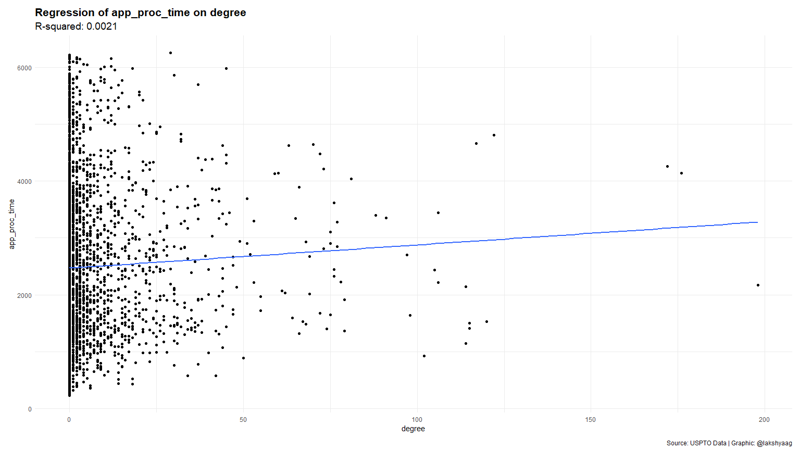
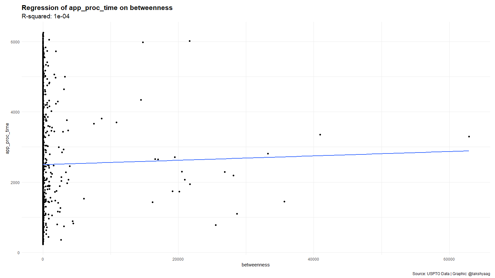
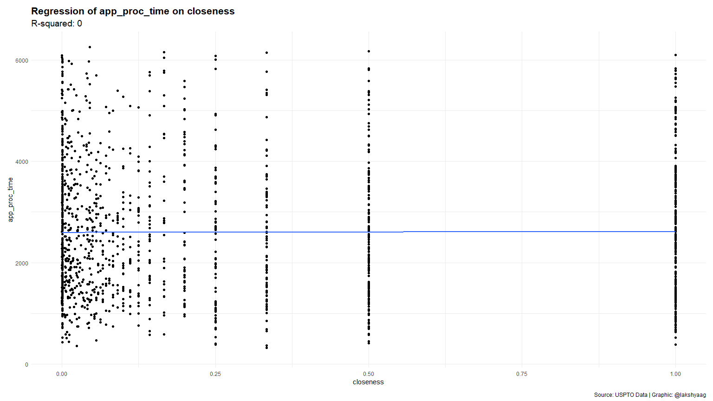
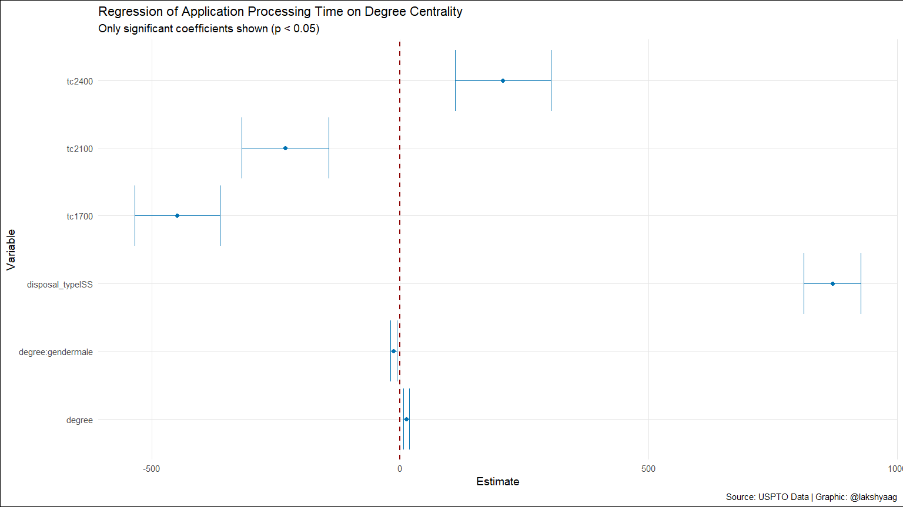

# Exercise 4: ORGB 672

Lakshya Agarwal
2024-04-08

- [Exercise 4: ORGB 672](#exercise-4-orgb-672)
- [Setup](#setup)
- [Code](#code)
  - [Loading and viewing the data](#loading-and-viewing-the-data)
    - [Dropping applications with pending status](#dropping-applications-with-pending-status)
  - [Get gender and race for examiners](#get-gender-and-race-for-examiners)
  - [Calculate application processing time](#calculate-application-processing-time)
  - [Viewing the cleaned dataset](#viewing-the-cleaned-dataset)
  - [Creating a network](#creating-a-network)
  - [Calculating the centrality measures](#calculating-the-centrality-measures)
  - [Running regression models](#running-regression-models)
    - [Application time on degree centrality](#application-time-on-degree-centrality)
    - [Application time on betweenness centrality](#application-time-on-betweenness-centrality)
    - [Application time on closeness centrality](#application-time-on-closeness-centrality)
    - [Application times on all centrality measures and gender and race](#application-times-on-all-centrality-measures-and-gender-and-race)
    - [Application time on all centrality measures, gender and race, with other variables](#application-time-on-all-centrality-measures-gender-and-race-with-other-variables)
  - [Looking at the final model closely](#looking-at-the-final-model-closely)
- [Interpretation of the model](#interpretation-of-the-model)
  - [Implications for the USPTO](#implications-for-the-uspto)

# Setup

```r
library(tidygraph)
```

    ## Warning: package 'tidygraph' was built under R version 4.3.3

    ##
    ## Attaching package: 'tidygraph'

    ## The following object is masked from 'package:stats':
    ##
    ##     filter

```r
library(tidyverse)
```

    ## ── Attaching core tidyverse packages ──────────────────────── tidyverse 2.0.0 ──
    ## ✔ dplyr     1.1.2     ✔ readr     2.1.4
    ## ✔ forcats   1.0.0     ✔ stringr   1.5.0
    ## ✔ ggplot2   3.4.3     ✔ tibble    3.2.1
    ## ✔ lubridate 1.9.2     ✔ tidyr     1.3.0
    ## ✔ purrr     1.0.2

    ## ── Conflicts ────────────────────────────────────────── tidyverse_conflicts() ──
    ## ✖ dplyr::filter() masks tidygraph::filter(), stats::filter()
    ## ✖ dplyr::lag()    masks stats::lag()
    ## ℹ Use the conflicted package (<http://conflicted.r-lib.org/>) to force all conflicts to become errors

```r
library(igraph)
```

    ## Warning: package 'igraph' was built under R version 4.3.3

    ##
    ## Attaching package: 'igraph'
    ##
    ## The following objects are masked from 'package:lubridate':
    ##
    ##     %--%, union
    ##
    ## The following objects are masked from 'package:dplyr':
    ##
    ##     as_data_frame, groups, union
    ##
    ## The following objects are masked from 'package:purrr':
    ##
    ##     compose, simplify
    ##
    ## The following object is masked from 'package:tidyr':
    ##
    ##     crossing
    ##
    ## The following object is masked from 'package:tibble':
    ##
    ##     as_data_frame
    ##
    ## The following object is masked from 'package:tidygraph':
    ##
    ##     groups
    ##
    ## The following objects are masked from 'package:stats':
    ##
    ##     decompose, spectrum
    ##
    ## The following object is masked from 'package:base':
    ##
    ##     union

```r
library(ggplot2)
library(vroom)
```

    ##
    ## Attaching package: 'vroom'
    ##
    ## The following objects are masked from 'package:readr':
    ##
    ##     as.col_spec, col_character, col_date, col_datetime, col_double,
    ##     col_factor, col_guess, col_integer, col_logical, col_number,
    ##     col_skip, col_time, cols, cols_condense, cols_only, date_names,
    ##     date_names_lang, date_names_langs, default_locale, fwf_cols,
    ##     fwf_empty, fwf_positions, fwf_widths, locale, output_column,
    ##     problems, spec

```r
library(arrow)
```

    ## Warning: package 'arrow' was built under R version 4.3.3

    ##
    ## Attaching package: 'arrow'
    ##
    ## The following object is masked from 'package:lubridate':
    ##
    ##     duration
    ##
    ## The following object is masked from 'package:utils':
    ##
    ##     timestamp

```r
library(scales)
```

    ##
    ## Attaching package: 'scales'
    ##
    ## The following object is masked from 'package:vroom':
    ##
    ##     col_factor
    ##
    ## The following object is masked from 'package:purrr':
    ##
    ##     discard
    ##
    ## The following object is masked from 'package:readr':
    ##
    ##     col_factor

```r
library(purrr)
library(broom)
library(ggraph)
library(ggtext)
library(ggrepel)
library(ggforce)
library(ggthemes)
library(patchwork)
library(qualpalr)
```

    ## Warning: package 'qualpalr' was built under R version 4.3.3

```r
library(gender)
```

    ## Warning: package 'gender' was built under R version 4.3.3

```r
library(wru)
```

    ## Warning: package 'wru' was built under R version 4.3.3

    ##
    ## Please cite as:
    ##
    ## Khanna K, Bertelsen B, Olivella S, Rosenman E, Rossell Hayes A, Imai K
    ## (2024). _wru: Who are You? Bayesian Prediction of Racial Category Using
    ## Surname, First Name, Middle Name, and Geolocation_. R package version
    ## 3.0.1, <https://CRAN.R-project.org/package=wru>.
    ##
    ## Note that wru 2.0.0 uses 2020 census data by default.
    ## Use the argument `year = "2010"`, to replicate analyses produced with earlier package versions.

```r
library(skimr)
```

    ##
    ## Attaching package: 'skimr'
    ##
    ## The following object is masked from 'package:tidygraph':
    ##
    ##     focus

```r
library(lubridate)

# setwd("./Exercise 4")
```

# Code

## Loading and viewing the data

```r
patent_data <- read_parquet("app_data_sample.parquet")
edge_data <- vroom("edges_sample.csv", delim = ",")
```

    ## Rows: 32906 Columns: 4
    ## ── Column specification ────────────────────────────────────────────────────────
    ## Delimiter: ","
    ## chr  (1): application_number
    ## dbl  (2): ego_examiner_id, alter_examiner_id
    ## date (1): advice_date
    ##
    ## ℹ Use `spec()` to retrieve the full column specification for this data.
    ## ℹ Specify the column types or set `show_col_types = FALSE` to quiet this message.

### Dropping applications with pending status

```r
patent_data <- patent_data %>%
  filter(disposal_type != "PEND")
```

```r
patent_data
```

    ## # A tibble: 1,688,717 × 16
    ##    application_number filing_date examiner_name_last examiner_name_first
    ##    <chr>              <date>      <chr>              <chr>
    ##  1 08284457           2000-01-26  HOWARD             JACQUELINE
    ##  2 08413193           2000-10-11  YILDIRIM           BEKIR
    ##  3 08531853           2000-05-17  HAMILTON           CYNTHIA
    ##  4 08637752           2001-07-20  MOSHER             MARY
    ##  5 08682726           2000-04-10  BARR               MICHAEL
    ##  6 08687412           2000-04-28  GRAY               LINDA
    ##  7 08765941           2000-06-23  FORD               VANESSA
    ##  8 08776818           2000-02-04  STRZELECKA         TERESA
    ##  9 08809677           2002-02-20  KIM                SUN
    ## 10 08836939           2000-06-13  WOOD               ELIZABETH
    ## # ℹ 1,688,707 more rows
    ## # ℹ 12 more variables: examiner_name_middle <chr>, examiner_id <dbl>,
    ## #   examiner_art_unit <dbl>, uspc_class <chr>, uspc_subclass <chr>,
    ## #   patent_number <chr>, patent_issue_date <date>, abandon_date <date>,
    ## #   disposal_type <chr>, appl_status_code <dbl>, appl_status_date <chr>,
    ## #   tc <dbl>

## Get gender and race for examiners

Using the library `gender`, extract the gender from a list of distinct
`examiner_name_first` values. This will give us the gender of each first
name according to the library, which we can then join to our original
data

```r
examiner_names <- patent_data %>%
  distinct(examiner_name_first)

examiner_names_gender <- examiner_names %>%
  do(results = gender(.$examiner_name_first, method = "ssa")) %>%
  unnest(cols = c(results), keep_empty = TRUE) %>%
  select(
    examiner_name_first = name,
    gender,
    proportion_female
  )

examiner_names_gender <- examiner_names_gender %>%
  select(examiner_name_first, gender)

patent_data <- patent_data %>%
  left_join(
    examiner_names_gender,
    by = "examiner_name_first"
  )

patent_data %>% head(10)
```

    ## # A tibble: 10 × 17
    ##    application_number filing_date examiner_name_last examiner_name_first
    ##    <chr>              <date>      <chr>              <chr>
    ##  1 08284457           2000-01-26  HOWARD             JACQUELINE
    ##  2 08413193           2000-10-11  YILDIRIM           BEKIR
    ##  3 08531853           2000-05-17  HAMILTON           CYNTHIA
    ##  4 08637752           2001-07-20  MOSHER             MARY
    ##  5 08682726           2000-04-10  BARR               MICHAEL
    ##  6 08687412           2000-04-28  GRAY               LINDA
    ##  7 08765941           2000-06-23  FORD               VANESSA
    ##  8 08776818           2000-02-04  STRZELECKA         TERESA
    ##  9 08809677           2002-02-20  KIM                SUN
    ## 10 08836939           2000-06-13  WOOD               ELIZABETH
    ## # ℹ 13 more variables: examiner_name_middle <chr>, examiner_id <dbl>,
    ## #   examiner_art_unit <dbl>, uspc_class <chr>, uspc_subclass <chr>,
    ## #   patent_number <chr>, patent_issue_date <date>, abandon_date <date>,
    ## #   disposal_type <chr>, appl_status_code <dbl>, appl_status_date <chr>,
    ## #   tc <dbl>, gender <chr>

Using the library `wru`, extract race from a list of distinct
`examiner_name_first` values. This will give us the race probabilities
of each last name according to the library, which we can then take a
maximum on and join the results to our original data.

This process involves using the `predict_race` function from the `wru`
package, which estimates the race/ethnicity of a name based on U.S.
Census data. It’s important to note that this method provides an
estimate based on statistical models and should be used with an
understanding of its limitations and potential biases.

```r
examiner_surnames <- patent_data %>%
  select(surname = examiner_name_last) %>%
  distinct()

examiner_race <- predict_race(
  voter.file = examiner_surnames,
  surname.only = TRUE
) %>% as_tibble()
```

    ## Predicting race for 2020

    ## Warning: Unknown or uninitialised column: `state`.

    ## Proceeding with last name predictions...

    ## ℹ All local files already up-to-date!

    ## 686 (18.3%) individuals' last names were not matched.

```r
examiner_race <- examiner_race %>%
  mutate(max_race_p = pmax(
    pred.asi,
    pred.bla,
    pred.his,
    pred.oth,
    pred.whi
  )) %>%
  mutate(race = case_when(
    max_race_p == pred.asi ~ "Asian",
    max_race_p == pred.bla ~ "black",
    max_race_p == pred.his ~ "Hispanic",
    max_race_p == pred.oth ~ "other",
    max_race_p == pred.whi ~ "white",
    TRUE ~ NA_character_
  )) %>%
  select(surname, race)

patent_data <- patent_data %>%
  left_join(examiner_race, by = c("examiner_name_last" = "surname"))

patent_data %>% head(10)
```

    ## # A tibble: 10 × 18
    ##    application_number filing_date examiner_name_last examiner_name_first
    ##    <chr>              <date>      <chr>              <chr>
    ##  1 08284457           2000-01-26  HOWARD             JACQUELINE
    ##  2 08413193           2000-10-11  YILDIRIM           BEKIR
    ##  3 08531853           2000-05-17  HAMILTON           CYNTHIA
    ##  4 08637752           2001-07-20  MOSHER             MARY
    ##  5 08682726           2000-04-10  BARR               MICHAEL
    ##  6 08687412           2000-04-28  GRAY               LINDA
    ##  7 08765941           2000-06-23  FORD               VANESSA
    ##  8 08776818           2000-02-04  STRZELECKA         TERESA
    ##  9 08809677           2002-02-20  KIM                SUN
    ## 10 08836939           2000-06-13  WOOD               ELIZABETH
    ## # ℹ 14 more variables: examiner_name_middle <chr>, examiner_id <dbl>,
    ## #   examiner_art_unit <dbl>, uspc_class <chr>, uspc_subclass <chr>,
    ## #   patent_number <chr>, patent_issue_date <date>, abandon_date <date>,
    ## #   disposal_type <chr>, appl_status_code <dbl>, appl_status_date <chr>,
    ## #   tc <dbl>, gender <chr>, race <chr>

## Calculate application processing time

To estimate the time spent by on each application, we compare the filing
date and application status dates for each application. We then
calculate the difference between these two dates as the processing time.

```r
patent_data <- patent_data %>%
  mutate(app_proc_time = interval(
    ymd(filing_date),
    dmy_hms(appl_status_date)
  ) %/% days(1))

patent_data %>% head(10)
```

    ## # A tibble: 10 × 19
    ##    application_number filing_date examiner_name_last examiner_name_first
    ##    <chr>              <date>      <chr>              <chr>
    ##  1 08284457           2000-01-26  HOWARD             JACQUELINE
    ##  2 08413193           2000-10-11  YILDIRIM           BEKIR
    ##  3 08531853           2000-05-17  HAMILTON           CYNTHIA
    ##  4 08637752           2001-07-20  MOSHER             MARY
    ##  5 08682726           2000-04-10  BARR               MICHAEL
    ##  6 08687412           2000-04-28  GRAY               LINDA
    ##  7 08765941           2000-06-23  FORD               VANESSA
    ##  8 08776818           2000-02-04  STRZELECKA         TERESA
    ##  9 08809677           2002-02-20  KIM                SUN
    ## 10 08836939           2000-06-13  WOOD               ELIZABETH
    ## # ℹ 15 more variables: examiner_name_middle <chr>, examiner_id <dbl>,
    ## #   examiner_art_unit <dbl>, uspc_class <chr>, uspc_subclass <chr>,
    ## #   patent_number <chr>, patent_issue_date <date>, abandon_date <date>,
    ## #   disposal_type <chr>, appl_status_code <dbl>, appl_status_date <chr>,
    ## #   tc <dbl>, gender <chr>, race <chr>, app_proc_time <dbl>

```r
rm(examiner_race)
rm(examiner_surnames)
rm(examiner_names)
gc()
```

    ##            used  (Mb) gc trigger   (Mb)  max used   (Mb)
    ## Ncells  4513276 241.1    8243154  440.3   5979412  319.4
    ## Vcells 47169832 359.9  141058058 1076.2 140056141 1068.6

## Viewing the cleaned dataset

```r
patent_data
```

    ## # A tibble: 1,688,717 × 19
    ##    application_number filing_date examiner_name_last examiner_name_first
    ##    <chr>              <date>      <chr>              <chr>
    ##  1 08284457           2000-01-26  HOWARD             JACQUELINE
    ##  2 08413193           2000-10-11  YILDIRIM           BEKIR
    ##  3 08531853           2000-05-17  HAMILTON           CYNTHIA
    ##  4 08637752           2001-07-20  MOSHER             MARY
    ##  5 08682726           2000-04-10  BARR               MICHAEL
    ##  6 08687412           2000-04-28  GRAY               LINDA
    ##  7 08765941           2000-06-23  FORD               VANESSA
    ##  8 08776818           2000-02-04  STRZELECKA         TERESA
    ##  9 08809677           2002-02-20  KIM                SUN
    ## 10 08836939           2000-06-13  WOOD               ELIZABETH
    ## # ℹ 1,688,707 more rows
    ## # ℹ 15 more variables: examiner_name_middle <chr>, examiner_id <dbl>,
    ## #   examiner_art_unit <dbl>, uspc_class <chr>, uspc_subclass <chr>,
    ## #   patent_number <chr>, patent_issue_date <date>, abandon_date <date>,
    ## #   disposal_type <chr>, appl_status_code <dbl>, appl_status_date <chr>,
    ## #   tc <dbl>, gender <chr>, race <chr>, app_proc_time <dbl>

## Creating a network

To create a network of examiners, we first need to alter the edge and
node datasets to match the format expected by the `tidygraph` package.
We then create a graph object using the `tbl_graph` function and add
node data to it. We then calculate the degree, betweenness, and
closeness centrality measures for each node and visualize the network
using `ggraph`.

```r
edge_data <- edge_data %>%
  mutate(
    from = as.character(ego_examiner_id),
    to = as.character(alter_examiner_id)
  ) %>%
  drop_na()
```

```r
patent_data <- patent_data %>%
  relocate(examiner_id, .before = application_number) %>%
  mutate(examiner_id = as.character(examiner_id)) %>%
  drop_na(examiner_id) %>%
  rename(name = examiner_id)

patent_data
```

    ## # A tibble: 1,684,963 × 19
    ##    name  application_number filing_date examiner_name_last examiner_name_first
    ##    <chr> <chr>              <date>      <chr>              <chr>
    ##  1 96082 08284457           2000-01-26  HOWARD             JACQUELINE
    ##  2 87678 08413193           2000-10-11  YILDIRIM           BEKIR
    ##  3 63213 08531853           2000-05-17  HAMILTON           CYNTHIA
    ##  4 73788 08637752           2001-07-20  MOSHER             MARY
    ##  5 77294 08682726           2000-04-10  BARR               MICHAEL
    ##  6 68606 08687412           2000-04-28  GRAY               LINDA
    ##  7 97543 08765941           2000-06-23  FORD               VANESSA
    ##  8 98714 08776818           2000-02-04  STRZELECKA         TERESA
    ##  9 65530 08809677           2002-02-20  KIM                SUN
    ## 10 77112 08836939           2000-06-13  WOOD               ELIZABETH
    ## # ℹ 1,684,953 more rows
    ## # ℹ 14 more variables: examiner_name_middle <chr>, examiner_art_unit <dbl>,
    ## #   uspc_class <chr>, uspc_subclass <chr>, patent_number <chr>,
    ## #   patent_issue_date <date>, abandon_date <date>, disposal_type <chr>,
    ## #   appl_status_code <dbl>, appl_status_date <chr>, tc <dbl>, gender <chr>,
    ## #   race <chr>, app_proc_time <dbl>

This next chunk of code will create the overall USPTO graph from the
provided edge list.

```r
graph <- tbl_graph(
  edges = (edge_data %>% relocate(from, to)),
  directed = TRUE
)

graph <- graph %>%
  activate(nodes) %>%
  inner_join(
    (patent_data %>% distinct(name, .keep_all = TRUE)),
    by = "name"
  )

graph
```

    ## # A tbl_graph: 2489 nodes and 17720 edges
    ## #
    ## # A directed multigraph with 127 components
    ## #
    ## # Node Data: 2,489 × 19 (active)
    ##    name  application_number filing_date examiner_name_last examiner_name_first
    ##    <chr> <chr>              <date>      <chr>              <chr>
    ##  1 84356 09402488           2000-02-16  STEADMAN           DAVID
    ##  2 66266 09509710           2000-06-15  BRUMBACK           BRENDA
    ##  3 63519 09463947           2000-02-04  WEBER              JON
    ##  4 98531 09423418           2000-06-22  BRAGDON            KATHLEEN
    ##  5 92953 09445135           2000-03-13  RAMAN              USHA
    ##  6 93865 10481715           2004-06-01  WONG               JOSEPH
    ##  7 91818 09424167           2000-05-30  PILLAI             NAMITHA
    ##  8 66805 09486723           2000-05-18  PICH               PONNOREAY
    ##  9 70919 09703038           2000-10-31  SAM                PHIRIN
    ## 10 72253 09242244           2000-02-29  WOITACH            JOSEPH
    ## # ℹ 2,479 more rows
    ## # ℹ 14 more variables: examiner_name_middle <chr>, examiner_art_unit <dbl>,
    ## #   uspc_class <chr>, uspc_subclass <chr>, patent_number <chr>,
    ## #   patent_issue_date <date>, abandon_date <date>, disposal_type <chr>,
    ## #   appl_status_code <dbl>, appl_status_date <chr>, tc <dbl>, gender <chr>,
    ## #   race <chr>, app_proc_time <dbl>
    ## #
    ## # Edge Data: 17,720 × 6
    ##    from    to application_number advice_date ego_examiner_id alter_examiner_id
    ##   <int> <int> <chr>              <date>                <dbl>             <dbl>
    ## 1     1     2 09402488           2008-11-17            84356             66266
    ## 2     1     3 09402488           2008-11-17            84356             63519
    ## 3     1     4 09402488           2008-11-17            84356             98531
    ## # ℹ 17,717 more rows

## Calculating the centrality measures

For each examiner in the network, calculate the different centrality
measures: degree, betweenness, and closeness.

```r
node_data <- graph %>%
  activate(nodes) %>%
  mutate(
    degree = centrality_degree(),
    betweenness = centrality_betweenness(),
    closeness = centrality_closeness()
  ) %>%
  arrange(-degree) %>%
  as_tibble() %>%
  mutate(tc = as.factor(tc))

node_data
```

    ## # A tibble: 2,489 × 22
    ##    name  application_number filing_date examiner_name_last examiner_name_first
    ##    <chr> <chr>              <date>      <chr>              <chr>
    ##  1 83670 09856864           2001-07-05  LEE                JAE
    ##  2 97910 09486362           2000-02-28  COUNTS             GARY
    ##  3 73920 10373614           2003-02-25  HOBBS              LISA
    ##  4 67226 09483069           2000-01-14  ZHEN               LI
    ##  5 80730 10345713           2003-01-16  JOY                DAVID
    ##  6 75615 09943424           2001-08-30  DECKER             CASSANDRA
    ##  7 62152 10486872           2004-08-12  SIDDIQUEE          MUHAMMAD
    ##  8 69098 10491238           2004-11-15  VASISTH            VISHAL
    ##  9 67690 09504184           2000-02-15  MCINTOSH III       TRAVISS
    ## 10 74061 10480716           2004-07-02  TRAN               THINH
    ## # ℹ 2,479 more rows
    ## # ℹ 17 more variables: examiner_name_middle <chr>, examiner_art_unit <dbl>,
    ## #   uspc_class <chr>, uspc_subclass <chr>, patent_number <chr>,
    ## #   patent_issue_date <date>, abandon_date <date>, disposal_type <chr>,
    ## #   appl_status_code <dbl>, appl_status_date <chr>, tc <fct>, gender <chr>,
    ## #   race <chr>, app_proc_time <dbl>, degree <dbl>, betweenness <dbl>,
    ## #   closeness <dbl>

## Running regression models

We will now run a series of regression models to explore the
relationship between the centrality measures and the application
processing time.

To do so, first we define a function that runs a regression model for a
given centrality measure and returns the summary statistics.

```r
run_regression <- function(data, x, y, plot = TRUE) {
  formula <- as.formula(paste(y, "~", x))
  model <- lm(formula, data = data)

  if (plot) {
    plot_data <- ggplot(data, aes_string(x, y)) +
      geom_point() +
      geom_smooth(method = "lm", se = FALSE) +
      labs(
        title = paste("Regression of", y, "on", x),
        subtitle = paste("R-squared:", round(summary(model)$r.squared, 4)),
        x = x,
        y = y
      ) +
      theme_minimal() +
      theme(
        plot.title = element_text(size = 16, face = "bold"),
        plot.subtitle = element_text(size = 14)
      ) +
      plot_annotation(
        caption = "Source: USPTO Data | Graphic: @lakshyaag"
      )

    ggsave(paste0(y, "_on_", x, ".png"), plot_data, width = 16, height = 9)

    print(plot_data)
  }

  # Return a tidy dataframe of the model summary
  tidy_model <- tidy(model)
  glance_model <- glance(model)

  # Add R-squared and centrality measure (extracted from x) to the tidy dataframe
  tidy_model <- tidy_model %>%
    mutate(
      r_squared = glance_model$r.squared,
      centrality_measure = x
    )

  return(tidy_model)
}
```

### Application time on degree centrality

```r
run_regression(node_data, "degree", "app_proc_time")
```

    ## Warning: `aes_string()` was deprecated in ggplot2 3.0.0.
    ## ℹ Please use tidy evaluation idioms with `aes()`.
    ## ℹ See also `vignette("ggplot2-in-packages")` for more information.
    ## This warning is displayed once every 8 hours.
    ## Call `lifecycle::last_lifecycle_warnings()` to see where this warning was
    ## generated.

    ## `geom_smooth()` using formula = 'y ~ x'
    ## `geom_smooth()` using formula = 'y ~ x'

<!-- -->

    ## # A tibble: 2 × 7
    ##   term        estimate std.error statistic p.value r_squared centrality_measure
    ##   <chr>          <dbl>     <dbl>     <dbl>   <dbl>     <dbl> <chr>
    ## 1 (Intercept)  2469.       30.6      80.7   0        0.00208 degree
    ## 2 degree          4.09      1.79      2.28  0.0228   0.00208 degree

### Application time on betweenness centrality

```r
run_regression(node_data, "betweenness", "app_proc_time")
```

    ## `geom_smooth()` using formula = 'y ~ x'
    ## `geom_smooth()` using formula = 'y ~ x'

<!-- -->

    ## # A tibble: 2 × 7
    ##   term         estimate std.error statistic p.value r_squared centrality_measure
    ##   <chr>           <dbl>     <dbl>     <dbl>   <dbl>     <dbl> <chr>
    ## 1 (Intercept)   2.50e+3   28.0       89.1     0      0.000126 betweenness
    ## 2 betweenness   6.23e-3    0.0111     0.560   0.575  0.000126 betweenness

### Application time on closeness centrality

```r
run_regression(node_data, "closeness", "app_proc_time")
```

    ## `geom_smooth()` using formula = 'y ~ x'

    ## Warning: Removed 1053 rows containing non-finite values (`stat_smooth()`).

    ## Warning: Removed 1053 rows containing missing values (`geom_point()`).

    ## `geom_smooth()` using formula = 'y ~ x'

    ## Warning: Removed 1053 rows containing non-finite values (`stat_smooth()`).
    ## Removed 1053 rows containing missing values (`geom_point()`).

<!-- -->

    ## # A tibble: 2 × 7
    ##   term        estimate std.error statistic p.value r_squared centrality_measure
    ##   <chr>          <dbl>     <dbl>     <dbl>   <dbl>     <dbl> <chr>
    ## 1 (Intercept)   2596.       44.4    58.5     0     0.0000226 closeness
    ## 2 closeness       17.3      96.2     0.180   0.857 0.0000226 closeness

### Application times on all centrality measures and gender and race

Since the above models have a very low R-squared value, we now add
additional variables to the model to see if we can improve the fit,
starting with gender and race.

```r
centrality_measures <- c("degree", "betweenness", "closeness")

results_df <- map_dfr(
  centrality_measures,
  ~ run_regression(node_data,
    paste0(.x, " * gender * race"),
    "app_proc_time",
    plot = FALSE
  )
)

# Looking at the R-squared values for each model
results_df %>%
  select(centrality_measure, r_squared) %>%
  distinct()
```

    ## # A tibble: 3 × 2
    ##   centrality_measure          r_squared
    ##   <chr>                           <dbl>
    ## 1 degree * gender * race        0.00853
    ## 2 betweenness * gender * race   0.00416
    ## 3 closeness * gender * race     0.00788

### Application time on all centrality measures, gender and race, with other variables

Now we include other important variables, namely `disposal_type` and
`tc`.

```r
results_df_2 <- map_dfr(
  centrality_measures,
  ~ run_regression(node_data,
    paste0(.x, " * gender * race + disposal_type + tc"),
    "app_proc_time",
    plot = FALSE
  )
)

# Looking at the R-squared values for each model
results_df_2 %>%
  select(centrality_measure, r_squared) %>%
  distinct()
```

    ## # A tibble: 3 × 2
    ##   centrality_measure                               r_squared
    ##   <chr>                                                <dbl>
    ## 1 degree * gender * race + disposal_type + tc          0.135
    ## 2 betweenness * gender * race + disposal_type + tc     0.132
    ## 3 closeness * gender * race + disposal_type + tc       0.177

## Looking at the final model closely

```r
best_model <- results_df_2 %>%
  filter(str_starts(centrality_measure, "degree"))

model_coeffs <- ggplot(
  best_model %>% filter(term != "(Intercept)") %>% filter(p.value < 0.05),
  aes(
    x = term,
    y = estimate,
    ymin = estimate - std.error,
    ymax = estimate + std.error
  )
) +
  geom_point(color = "#0072B2", size = 2) +
  geom_errorbar(color = "#0072B2", fatten = 4, lwd = 0.5) +
  geom_hline(yintercept = 0, linetype = "dashed", color = "darkred", lwd = 1) +
  coord_flip() +
  labs(
    title = "Regression of Application Processing Time on Degree Centrality",
    subtitle = "Only significant coefficients shown (p < 0.05)",
    x = "Variable",
    y = "Estimate",
    caption = "Source: USPTO Data | Graphic: @lakshyaag"
  ) +
  theme_minimal(base_size = 14) +
  theme(
    plot.background = element_rect(fill = "white"),
    panel.grid.major = element_line(color = "#e5e5e5"),
    panel.grid.minor = element_blank(),
  )
```

    ## Warning in geom_errorbar(color = "#0072B2", fatten = 4, lwd = 0.5): Ignoring
    ## unknown parameters: `fatten`

```r
model_coeffs
```

<!-- -->

```r
ggsave("model_coeffs.png", model_coeffs, width = 16, height = 9)

best_model
```

    ## # A tibble: 24 × 7
    ##    term       estimate std.error statistic  p.value r_squared centrality_measure
    ##    <chr>         <dbl>     <dbl>     <dbl>    <dbl>     <dbl> <chr>
    ##  1 (Intercep…   1970.     122.      16.2   1.53e-55     0.135 degree * gender *…
    ##  2 degree         12.6      5.50     2.29  2.21e- 2     0.135 degree * gender *…
    ##  3 gendermale    123.     119.       1.04  3.00e- 1     0.135 degree * gender *…
    ##  4 raceblack     497.     311.       1.60  1.10e- 1     0.135 degree * gender *…
    ##  5 raceHispa…    213.     398.       0.536 5.92e- 1     0.135 degree * gender *…
    ##  6 raceother   -1251.    1415.      -0.884 3.77e- 1     0.135 degree * gender *…
    ##  7 racewhite     165.     127.       1.30  1.95e- 1     0.135 degree * gender *…
    ##  8 disposal_…    870.      57.4     15.1   3.15e-49     0.135 degree * gender *…
    ##  9 tc1700       -448.      86.0     -5.21  2.06e- 7     0.135 degree * gender *…
    ## 10 tc2100       -231.      87.4     -2.64  8.28e- 3     0.135 degree * gender *…
    ## # ℹ 14 more rows

# Interpretation of the model

The selected model fits the application processing time as a function
of:

$$
\begin{align*}
y &= \beta_0 + \beta_1 \cdot \text{DegreeCentrality} + \\
  & \beta_2 \cdot \text{Gender} + \beta_3 \cdot \text{Race} + \\
  & \beta_4 \cdot \text{DisposalType} + \beta_5 \cdot \text{TechnologyCenter} + \\
  & \beta_6 \cdot (\text{DegreeCentrality} \times \text{Gender}) + \\
  & \beta_7 \cdot (\text{DegreeCentrality} \times \text{Race}) + \\
  & \beta_8 \cdot (\text{Gender} \times \text{Race}) + \\
  & \beta_9 \cdot (\text{DegreeCentrality} \times \text{Gender} \times \text{Race}) + \epsilon
\end{align*}
$$

where $y$ represents the application processing time.

The model has an R-squared value of 0.135, indicating that 13.5% of the
variance in application processing time can be explained by the
variables included in the model. The coefficients of the model indicate
the effect of each variable on the application processing time.

The base variables for the categorical variables are:

- Gender: `female`
- Race: `Asian`
- Disposal Type: `ABN`
- TC: `1600`

Keeping only the significant coefficients with a p-value of less than
0.05, we can see that:

- The degree centrality coefficient of 12.6 indicates that a one-unit
  increase in degree centrality is associated with a 12.6 day increase
  in application processing time. This suggests that examiners with
  higher degree centrality take longer to process applications, possibly
  due to a higher workload or complexity of applications.
- The `disposal_typeISS` coefficient of 869.66 indicates that
  applications with a `ISS` disposal type take 869.66 days longer to
  process than applications with an `ABN` disposal type. This suggests
  that patents that get issued take significantly longer to process than
  those that are abandoned.
- The `gendermale` coefficient of 123.12 indicates that applications
  assigned to a male examiner take 123.12 days longer to process than
  applications assigned to female examiners. This suggests that there
  may be delays or differences in processing times based on the gender
  of the examiner.

## Implications for the USPTO

Understanding these relationships can help the USPTO identify factors
influencing application processing times. If centrality significantly
impacts processing time, strategies to distribute workloads more evenly
or foster efficient collaboration networks could be considered.
Additionally, identifying any disparities by gender / race could inform
policies to ensure equitable work environments.
